## 🎯 项目概览

### 技术架构
**后端技术栈 (Spring Boot 3.4.3)**
- **核心框架**: Spring Boot 3.4.3 + Java 17
- **数据库**: MySQL 8.4.4 + MyBatis-Plus 3.5.10.1
- **缓存**: Redis (用于会话管理、缓存预热、限流)
- **消息队列**: RabbitMQ (异步消息处理)
- **实时通信**: WebSocket + STOMP协议
- **安全认证**: Spring Security + JWT
- **其他**: Lombok、FastJSON2、邮件服务

**前端技术栈 (Vue 3.5.13)**
- **核心框架**: Vue 3 + Composition API
- **UI组件库**: Element Plus 2.9.6
- **构建工具**: Vite 6.1.0
- **路由**: Vue Router 4.5.0
- **HTTP客户端**: Axios 1.8.2
- **WebSocket**: @stomp/stompjs + SockJS

## 📊 数据库设计分析

### 核心表结构
1. **用户表 (db_account)**
   - 用户基本信息：ID、用户名、密码、邮箱、角色、注册时间、头像

2. **好友关系表 (friends)**
   - 支持好友请求状态：requested、accepted、rejected、deleted
   - 乐观锁版本控制，防止并发冲突

3. **群组系统**
   - **群组表 (group)**: 群组基本信息
   - **群组成员表 (group_members)**: 用户-群组关系
   - **群组邀请表 (group_invitations)**: 群组邀请管理

4. **消息系统**
   - **私聊消息表 (private_messages)**: 支持文本、文件、图片、视频、音频
   - **群聊消息表 (group_messages)**: 群组消息记录

5. **系统优化表**
   - **缓存预热任务表 (cache_warmup_tasks)**: 缓存管理
   - **事件发布表 (outbox_events)**: 事件驱动架构

## 🏗️ 后端架构设计

### 分层架构
```
Controller层 → Service层 → Mapper层 → Database
     ↓
WebSocket层 (实时通信)
     ↓
Event层 (事件处理)
```

### 核心组件

**1. WebSocket实时通信**
```java
// 配置STOMP端点和消息代理
@Configuration
@EnableWebSocketMessageBroker
public class WebSocketConfig {
    // JWT认证集成
    // 心跳机制配置
    // 消息路由配置
}
```

**2. 安全认证系统**
```java
// JWT + Spring Security
@Configuration
public class SecurityConfiguration {
    // 无状态会话管理
    // JWT过滤器链
    // 权限控制
}
```

**3. 缓存策略**
- Redis缓存用户会话
- 智能缓存预热机制
- 聊天记录缓存优化

### 关键业务逻辑

**1. 消息发送流程**
```
用户发送消息 → WebSocket接收 → 消息持久化 → 实时推送 → 消息确认
```

**2. 好友管理**
- 好友请求 → 状态管理 → 实时通知 → 关系确认

**3. 群组管理**
- 群组创建 → 成员邀请 → 权限管理 → 消息广播

## 🎨 前端架构设计

### 组件化架构
```
App.vue
├── WelcomeView.vue (登录注册)
├── IndexView.vue (主界面)
│   ├── ChatView.vue (聊天主界面)
│   │   ├── Sidebar.vue (联系人列表)
│   │   ├── ChatArea.vue (聊天区域)
│   │   └── GroupDetailPanel.vue (群组详情)
│   └── ContactsView.vue (联系人管理)
```

### WebSocket客户端封装
```javascript
class StompClientWrapper {
    // 连接管理
    // 消息订阅
    // 自动重连
    // 心跳机制
    // 事件回调系统
}
```

## 🔄 实时通信机制

### WebSocket消息路由
- **私聊**: `/app/chat/private` → `/queue/private/{userId}`
- **群聊**: `/app/chat/channel` → `/topic/group/{groupId}`
- **系统消息**: `/app/system/*` → `/topic/system/*`

### 消息类型支持
- 文本消息
- 文件上传 (图片、视频、音频、文档)
- 系统通知
- 状态消息 (在线/离线)

## 🛡️ 安全机制

### 认证授权
- JWT Token认证
- 基于角色的访问控制
- WebSocket连接JWT验证

### 数据安全
- 密码加密存储
- SQL注入防护 (MyBatis-Plus)
- XSS防护
- CSRF保护

## ⚡ 性能优化

### 后端优化
1. **数据库优化**
   - 索引优化 (复合索引、唯一索引)
   - 乐观锁防止并发冲突
   - 分页查询减少数据传输

2. **缓存策略**
   - Redis缓存热点数据
   - 缓存预热机制
   - 智能缓存失效

3. **异步处理**
   - RabbitMQ消息队列
   - 事件驱动架构
   - 非阻塞IO

### 前端优化
1. **组件优化**
   - 虚拟滚动 (大量消息)
   - 懒加载
   - 组件缓存

2. **网络优化**
   - HTTP请求合并
   - WebSocket连接复用
   - 文件上传分片

## 🔧 关键技术要点

### 1. WebSocket + STOMP协议
- **优势**: 双向通信、低延迟、支持订阅模式
- **实现**: SockJS兼容性 + STOMP消息协议
- **特性**: 自动重连、心跳检测、消息确认

### 2. 事件驱动架构
- **Outbox模式**: 保证消息最终一致性
- **事件发布**: 解耦业务逻辑
- **异步处理**: 提升系统响应性

### 3. 乐观锁并发控制
```sql
-- 版本号控制
UPDATE friends SET status = 'accepted', version = version + 1 
WHERE id = ? AND version = ?
```

### 4. 智能缓存预热
```java
// 缓存预热任务
@Service
public class CacheWarmupService {
    // 预热策略
    // 优先级队列
    // 失败重试
}
```

## 🎯 可能的提问点及回答要点

### 技术选型问题
**Q: 为什么选择WebSocket而不是HTTP轮询？**
A: WebSocket提供全双工通信，延迟更低，服务器可主动推送，适合实时聊天场景。HTTP轮询会产生大量无效请求，浪费带宽。

### 架构设计问题
**Q: 如何保证消息的可靠性？**
A: 
1. 数据库持久化存储
2. 消息确认机制 (ACK)
3. Outbox事件模式保证最终一致性
4. 客户端重发机制

### 性能优化问题
**Q: 如何处理大量并发用户？**
A:
1. Redis缓存减少数据库压力
2. 数据库连接池优化
3. 异步消息处理
4. 前端虚拟滚动处理大量消息

### 安全性问题
**Q: 如何防止消息被恶意用户截获？**
A:
1. JWT Token认证
2. WebSocket连接时验证身份
3. 消息权限校验
4. HTTPS/WSS加密传输


## 📋 业务模块梳理计划

让我先查看各个模块的具体实现，然后逐一进行详细分析：


# 🏗️ 业务模块详细梳理

# 1️⃣ 用户模块 (User Module) 详细分析

## 🎯 业务逻辑概述

用户模块是整个聊天室应用的基础模块，负责用户的完整生命周期管理，包括注册、登录、认证、用户信息管理等核心功能。

## 🏗️ 代码架构分析

### 📁 后端架构层次
```
Controller层:
├── AuthorizeController.java    # 认证相关API (注册/登录/重置密码)
└── UserController.java         # 用户信息管理API (搜索用户)

Service层:
├── AccountService.java         # 用户服务接口定义
└── AccountServiceImpl.java     # 用户服务具体实现

Entity层:
├── Account.java               # 用户实体类
├── EmailRegisterVO.java       # 注册请求VO
└── AuthorizeVO.java           # 认证响应VO

Security层:
├── SecurityConfiguration.java  # Spring Security配置
├── JwtUtils.java              # JWT工具类
└── JwtAuthorizeFilter.java    # JWT认证过滤器
```

### 📁 前端架构层次
```
Views层:
├── WelcomeView.vue            # 认证主页面
│   ├── LoginPage.vue          # 登录页面
│   ├── RegisterPage.vue       # 注册页面
│   └── ForgetPage.vue         # 忘记密码页面

Utils层:
├── /net/index.js              # 网络请求封装
├── /utils/auth.js             # 认证工具函数
└── /router/index.js           # 路由守卫
```

## 🌟 技术亮点分析

### 1. **邮箱验证机制**
```java
// 发送邮箱验证码 - 使用RabbitMQ异步处理
@Override
public String registerEmailVerifyCode(String type, String email, String ip) {
    synchronized (ip.intern()) {  // IP级别的同步锁
        if (!this.verifyLimit(ip)) {
            return "请求频繁，请稍后再试";
        }
        Random random = new Random();
        int code = random.nextInt(899999) + 100000;  // 6位验证码
        Map<String, Object> data = Map.of("type", type, "email", email, "code", code);
        
        // 异步发送邮件
        amqpTemplate.convertAndSend("email", data);
        // Redis存储验证码，3分钟过期
        verificationCodeService.saveEmailCode(email, String.valueOf(code), Duration.ofMinutes(3));
        return null;
    }
}
```

**技术亮点**:
- ✨ **IP级别频率限制**: 使用`ip.intern()`作为锁对象，防止同一IP频繁请求
- ✨ **异步邮件发送**: RabbitMQ解耦邮件发送，提高响应速度
- ✨ **Redis缓存验证码**: 设置过期时间，自动清理

### 2. **JWT无状态认证**
```java
// Spring Security配置 - 无状态会话
.sessionManagement(conf -> conf
    .sessionCreationPolicy(SessionCreationPolicy.STATELESS))
.addFilterBefore(jwtAuthorizeFilter, UsernamePasswordAuthenticationFilter.class)
```

**技术亮点**:
- ✨ **无状态设计**: 支持分布式部署，无服务器状态依赖
- ✨ **自定义JWT过滤器**: 在Spring Security过滤器链中集成JWT验证
- ✨ **角色权限控制**: 支持用户角色管理和权限控制

### 3. **密码安全机制**
```java
// 密码加密存储
String encodedPassword = passwordEncoder.encode(password);
account.setPassword(encodedPassword);

// Spring Security UserDetailsService集成
@Override
public UserDetails loadUserByUsername(String username) throws UsernameNotFoundException {
    Account account = this.getAccountByEmail(username);
    if (account == null) {
        throw new UsernameNotFoundException("邮箱或密码错误");
    }
    return User.withUsername(account.getUsername())
               .password(account.getPassword())
               .roles(account.getRole())
               .build();
}
```

**技术亮点**:
- ✨ **BCrypt加密**: 使用Spring Security的PasswordEncoder
- ✨ **邮箱登录**: 统一使用邮箱作为登录凭证
- ✨ **角色集成**: 与Spring Security角色系统无缝集成

### 4. **用户搜索功能**
```java
@Override
public List<Account> searchUsers(String searchTerm) {
    return this.list(Wrappers.<Account>lambdaQuery()
        .like(Account::getUsername, searchTerm)
        .or()
        .like(Account::getEmail, searchTerm)
        .select(Account::getId, Account::getUsername, Account::getEmail));
}
```

**技术亮点**:
- ✨ **MyBatis-Plus Lambda查询**: 类型安全的查询构建
- ✨ **字段选择查询**: 只查询必要字段，优化性能
- ✨ **模糊搜索**: 支持用户名和邮箱的模糊匹配

## 🔄 运行流程详解

### 📝 用户注册流程
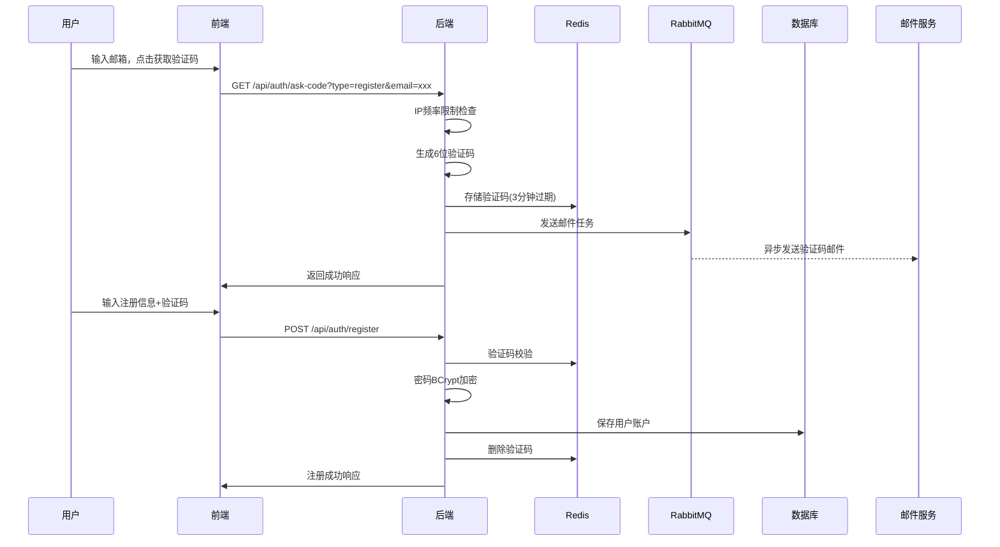

### 🔐 用户登录流程
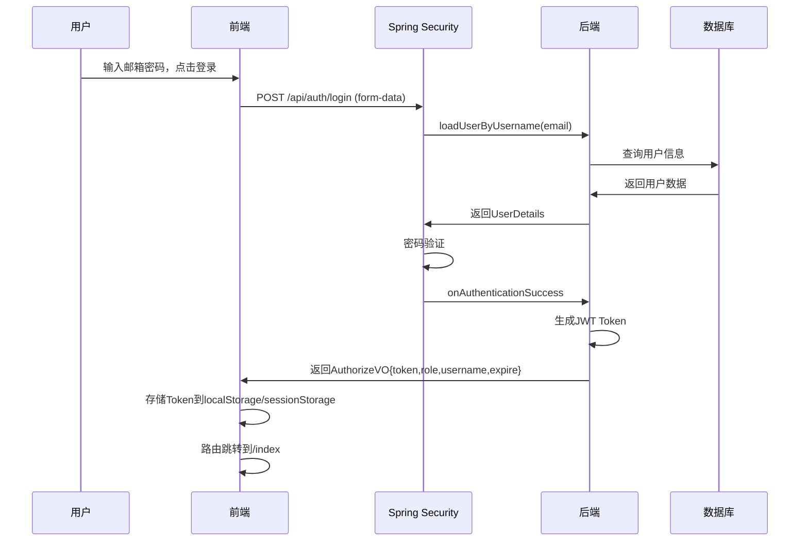

### 🔍 用户搜索流程
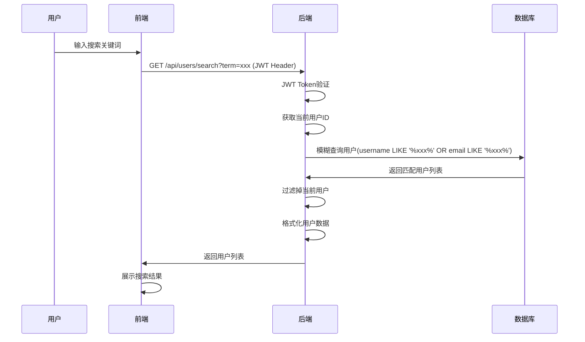

### 🚪 用户登出流程
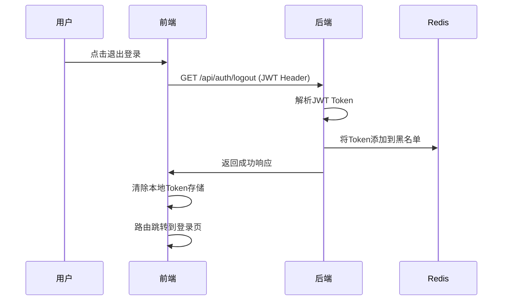

## 📊 数据模型设计

### 用户表结构 (db_account)
```sql
CREATE TABLE `db_account` (
  `id` int NOT NULL AUTO_INCREMENT,           -- 主键ID
  `username` varchar(255) DEFAULT NULL,       -- 用户名(非唯一)
  `password` varchar(255) DEFAULT NULL,       -- BCrypt加密密码
  `email` varchar(255) DEFAULT NULL,          -- 邮箱(登录凭证)
  `role` varchar(255) DEFAULT NULL,           -- 用户角色
  `register_time` datetime DEFAULT NULL,      -- 注册时间
  `avatar` varchar(255) DEFAULT NULL,         -- 头像URL
  PRIMARY KEY (`id`),
  INDEX `Idinex` (`id`)
) ENGINE=InnoDB DEFAULT CHARSET=utf8mb4;
```

## 🎯 业务特色功能

### 1. **智能频率限制**
- 基于IP的验证码请求限制(60秒内只能请求1次)
- 使用Redis实现分布式限流
- 防止恶意注册攻击

### 2. **邮箱唯一登录机制**
- 统一使用邮箱作为登录凭证
- 用户名允许重复，降低注册门槛
- 邮箱验证确保账户安全

### 3. **前端认证状态管理**
```javascript
// 统一的认证工具函数
export function getAuthToken() {
    const data = getAuthData();
    return data ? data.token : null;
}

export function isAuthenticated() {
    const data = getAuthData();
    return data && data.expire > Date.now();
}

// 路由守卫
router.beforeEach((to, from, next) => {
    const unauthorized = isUnauthorized();
    if(to.name && to.name.startsWith('welcome') && !unauthorized) {
        next('/index');  // 已登录用户跳转到主页
    } else if (to.path.startsWith('/index') && unauthorized) {
        next('/');       // 未登录用户跳转到登录页
    } else {
        next();
    }
});
```

# 2️⃣ 聊天模块 (Chat Module) 深度剖析

## 🎯 业务逻辑概述

聊天模块是整个应用的核心功能模块，实现了**实时双向通信**，支持**私聊**和**群聊**两种模式，包含文本消息、多媒体文件传输、消息状态管理、在线状态同步等完整的即时通讯功能。

## 🏗️ 代码架构分析

### 📁 后端分层架构
```
WebSocket层:
├── ChatController.java           # WebSocket消息处理控制器
├── WebSocketConfig.java          # WebSocket配置类

Service层:
├── ChatService.java             # 聊天服务接口
├── ChatServiceImpl.java         # 聊天服务实现
├── ChatCacheService.java        # 聊天缓存服务
├── OnlineStatusService.java     # 在线状态服务

Entity层:
├── ChatMessage.java             # 通用消息VO
├── PrivateChatMessage.java      # 私聊消息实体
├── Group_message.java           # 群聊消息实体

Controller层:
├── FileController.java          # 文件上传下载控制器

Config层:
├── RabbitConfiguration.java     # 消息队列配置
```

### 📁 前端架构层次
```
WebSocket层:
├── websocket.js                 # WebSocket客户端封装

Components层:
├── ChatView.vue                 # 聊天主界面
├── ChatArea.vue                 # 聊天区域组件
├── Sidebar.vue                  # 联系人侧边栏

API层:
├── chatApi.js                   # 聊天相关API
├── fileApi.js                   # 文件操作API
```

## 🌟 技术亮点分析

### 1. **WebSocket + STOMP协议栈**
```java
// WebSocket配置 - 支持JWT认证的连接握手
@Override  
protected Principal determineUser(ServerHttpRequest request, WebSocketHandler wsHandler, 
                                  Map<String, Object> attributes) {  
    String token = null;  
    String query = request.getURI().getQuery();  
    if (query != null && query.contains("token=")) {  
        token = query.substring(query.indexOf("token=") + 6);
        DecodedJWT jwt = jwtUtils.resolveJWTFromLocalStorage(token);  
        if (jwt != null) {  
            String username = jwt.getClaim("name").asString();
            String userId = jwt.getClaim("id").asString();
            return new CustomPrincipal(userId, username);  
        }  
    }  
    return null;  
}
```

**技术亮点**:
- ✨ **JWT握手认证**: WebSocket连接时验证JWT，确保安全性
- ✨ **STOMP消息协议**: 提供发布/订阅模式，支持消息路由
- ✨ **心跳机制**: 10秒心跳间隔，自动检测连接状态
- ✨ **自动重连**: 前端实现指数退避重连策略

### 2. **异步消息处理架构**
```java
// WebSocket接收消息后异步处理
@MessageMapping("/chat/private")
public void handlePrivateMessage(@Payload ChatMessage message, CustomPrincipal principal) {
    message.setSender(principal.getUsername());
    message.setSenderId(Integer.parseInt(principal.getName()));
    message.setTimestamp(Date.from(Instant.now()));
    
    // 异步持久化 - RabbitMQ解耦
    rabbitTemplate.convertAndSend("privateChat", message);
    
    // 实时推送给接收者
    messagingTemplate.convertAndSendToUser(
        message.getReceiverId().toString(),
        "/queue/private",
        message
    );
}
```

**技术亮点**:
- ✨ **消息队列解耦**: RabbitMQ异步处理消息持久化
- ✨ **实时推送**: WebSocket立即推送，不等待数据库操作
- ✨ **消息确认机制**: tempId临时ID追踪消息发送状态

### 3. **多层缓存策略**
```java
// 智能缓存实现 - 数据库+Redis双保险
@Override
public boolean savePrivateMessage(ChatMessage message) {
    PrivateChatMessage dbMessage = null;
    try {
        // 步骤1：先保存到数据库（关键路径）
        dbMessage = ConvertUtils.convertToPrivateChatMessage(message);
        privateMessageMapper.insert(dbMessage);
        
        // 步骤2：异步更新缓存（非关键路径）
        asyncUpdatePrivateMessageCache(message, dbMessage.getId());
        return true;
    } catch (Exception e) {
        logger.error("私聊消息保存失败", e);
        return dbMessage != null && dbMessage.getId() != null;
    }
}
```

**技术亮点**:
- ✨ **分离式缓存更新**: 数据库优先，缓存异步更新
- ✨ **Redis Lua脚本**: 原子性操作确保数据一致性
- ✨ **回退机制**: 缓存失败时从数据库获取数据

### 4. **文件消息处理系统**
```java
// 文件上传 - 支持多种文件类型
@PostMapping("/upload")
public ResponseEntity<JSONObject> uploadFile(@RequestParam("file") MultipartFile multipartFile) {
    String storedFilename = UUID.randomUUID().toString() + ext;
    Path filePath = Paths.get(uploadDir, storedFilename);
    Files.copy(multipartFile.getInputStream(), filePath);
    
    // 根据MIME类型自动识别消息类型
    String messageType = "FILE";
    if (multipartFile.getContentType() != null) {
        if (multipartFile.getContentType().startsWith("image/")) {
            messageType = "IMAGE";
        } else if (multipartFile.getContentType().startsWith("video/")) {
            messageType = "VIDEO";
        } else if (multipartFile.getContentType().startsWith("audio/")) {
            messageType = "AUDIO";
        }
    }
    
    response.put("fileUrl", "/api/files/download/" + storedFilename);
    response.put("messageType", messageType);
    return ResponseEntity.ok(response);
}
```

**技术亮点**:
- ✨ **MIME类型识别**: 自动识别文件类型并设置相应消息类型
- ✨ **UUID文件名**: 防止文件名冲突和安全问题
- ✨ **流式下载**: 支持大文件的流式传输

### 5. **前端WebSocket客户端封装**
```javascript
// 单例WebSocket客户端 - 完整的连接管理
class StompClientWrapper {
    constructor() {
        this.stompClient = shallowRef(null);
        this.isConnected = ref(false);
        this.reconnectAttempts = 0;
        this.maxReconnectAttempts = 5;
        this.callbacks = {
            onConnected: [],
            onPrivateMessage: [],
            onPublicMessage: [],
            onMessageAck: []
        };
    }
    
    // 生成唯一临时消息ID
    generateTempId() {
        this.messageSequence++;
        const timestamp = Date.now();
        const sequence = this.messageSequence.toString().padStart(6, '0');
        const random = Math.random().toString(36).substr(2, 6);
        return `temp_${timestamp}_${sequence}_${random}`;
    }
}
```

**技术亮点**:
- ✨ **单例模式**: 全局唯一WebSocket连接
- ✨ **Vue3响应式**: 使用ref/shallowRef实现状态响应
- ✨ **事件回调系统**: 灵活的事件监听和触发机制

## 🔄 运行流程详解

### 📝 私聊消息发送流程
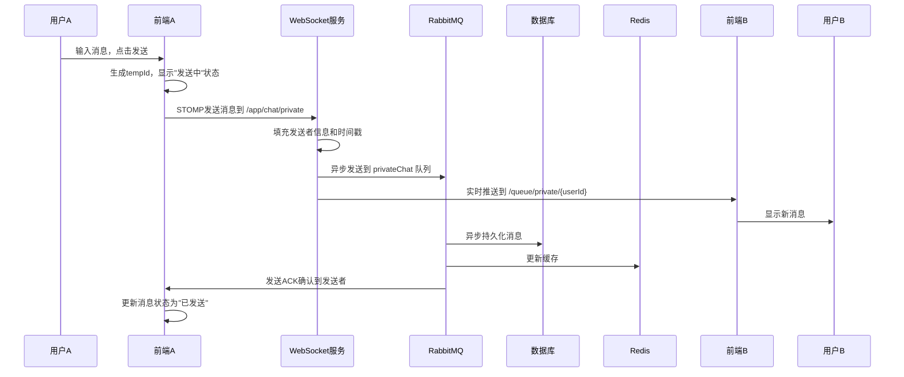

### 👥 群聊消息发送流程
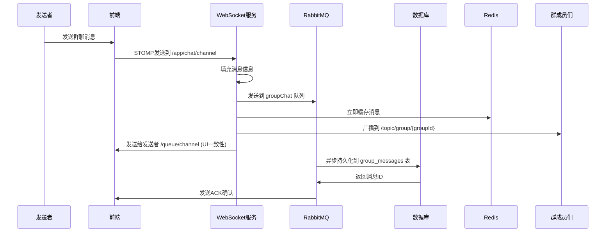

### 📂 文件消息发送流程
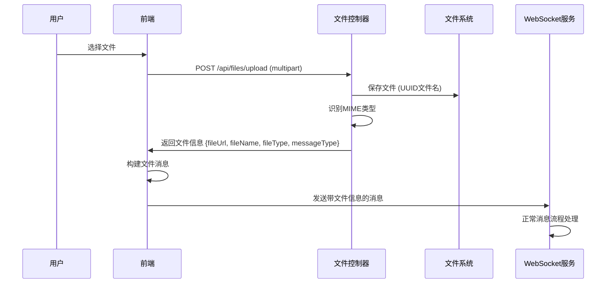

### 💓 心跳和在线状态流程
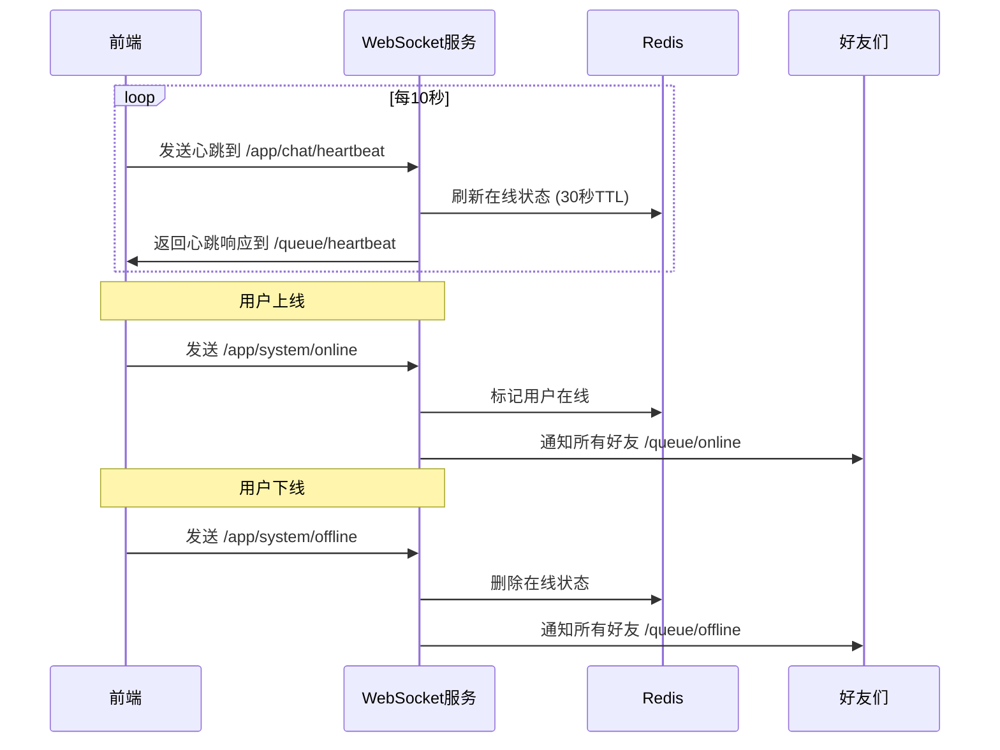

## 📊 数据模型设计

### 私聊消息表 (private_messages)
```sql
CREATE TABLE `private_messages` (
  `id` bigint NOT NULL AUTO_INCREMENT,
  `sender_id` int NOT NULL,                    -- 发送者ID
  `receiver_id` int NOT NULL,                  -- 接收者ID
  `content` text NOT NULL,                     -- 消息内容
  `is_read` tinyint(1) DEFAULT 0,             -- 是否已读
  `created_at` timestamp DEFAULT CURRENT_TIMESTAMP,
  `file_url` varchar(255) DEFAULT NULL,       -- 文件URL
  `file_name` varchar(255) DEFAULT NULL,      -- 文件原始名称
  `file_type` varchar(100) DEFAULT NULL,      -- 文件MIME类型
  `file_size` bigint DEFAULT NULL,            -- 文件大小
  `message_type` varchar(20) DEFAULT NULL,    -- 消息类型(TEXT/FILE/IMAGE/VIDEO/AUDIO)
  PRIMARY KEY (`id`),
  INDEX `idx_conversation` (`sender_id`, `receiver_id`, `created_at`)
);
```

### 群聊消息表 (group_messages)
```sql
CREATE TABLE `group_messages` (
  `id` bigint NOT NULL AUTO_INCREMENT,
  `groupId` varchar(255) NOT NULL,            -- 群组ID
  `content` text,                             -- 消息内容
  `SenderId` int DEFAULT NULL,                -- 发送者ID
  `Create_at` timestamp DEFAULT CURRENT_TIMESTAMP,
  `Content_type` smallint NOT NULL,           -- 内容类型(0:文本 1:图片 2:视频等)
  `File_url` varchar(512) DEFAULT NULL,      -- 文件URL
  `File_name` varchar(255) DEFAULT NULL,     -- 文件原始名称
  `File_type` varchar(100) DEFAULT NULL,     -- 文件MIME类型
  `File_size` bigint DEFAULT NULL,           -- 文件大小
  PRIMARY KEY (`id`),
  INDEX `idx_group_time` (`groupId`, `Create_at`)
);
```

## 🎯 业务特色功能

### 1. **智能消息类型识别**
```java
// 后端自动识别文件类型
if (message.getFileUrl() != null && !message.getFileUrl().isEmpty() && message.getMessageType() == null) {
    String messageType = "FILE";
    if (msg.getFileType() != null) {
        if (msg.getFileType().startsWith("image/")) {
            messageType = "IMAGE";
        } else if (msg.getFileType().startsWith("video/")) {
            messageType = "VIDEO";
        } else if (msg.getFileType().startsWith("audio/")) {
            messageType = "AUDIO"; 
        }
    }
    message.setMessageType(messageType);
}
```

### 2. **消息状态管理**
```javascript
// 前端消息状态追踪
const messageStates = {
    sending: '发送中',     // 刚发送，等待确认
    sent: '已发送',        // 服务器已接收
    delivered: '已送达',   // 对方客户端已接收
    read: '已读',          // 对方已读
    failed: '发送失败'     // 发送失败
};
```

### 3. **在线状态同步**
```java
// 实时在线状态管理
@MessageMapping("/system/online")
public void handleOnline(Principal principal, StatusMessage message) {
    String userId = principal.getName();
    onlineStatusService.markOnline(userId, Duration.ofSeconds(30));
    
    // 通知所有好友用户上线
    List<FriendsResponse> friends = chatService.getFriends(userId);
    for (FriendsResponse friend : friends) {
        String targetId = friend.getSecondUserId().equals(userId)
                ? friend.getFirstUserId()
                : friend.getSecondUserId();
        messagingTemplate.convertAndSendToUser(targetId, "/queue/online", message);
    }
}
```

### 4. **消息历史分页加载**
```java
// 基于消息ID的分页查询
@Override
public List<PrivateChatMessage> getPrivateChatHistoryByUserIdAndFriendId(
        int userId, int friendId, int limit, String oldestMessageId) {
    int id = Integer.parseInt(oldestMessageId);
    return privateMessageMapper.selectList(
        Wrappers.<PrivateChatMessage>lambdaQuery()
            .and(wq -> wq.eq(PrivateChatMessage::getSenderId, userId)
                        .eq(PrivateChatMessage::getReceiverId, friendId))
            .or(wq -> wq.eq(PrivateChatMessage::getSenderId, friendId)
                       .eq(PrivateChatMessage::getReceiverId, userId))
            .lt(PrivateChatMessage::getId, id)  // 只查询比oldestMessageId更早的消息
            .orderByDesc(PrivateChatMessage::getCreatedAt)
            .last("LIMIT " + limit)
    );
}
```

### 5. **前端消息优化显示**
```vue
<!-- 前端消息展示组件 -->
<template>
  <div class="message-item" :class="{ 'message-self': isSelfMessage(message) }">
    <el-avatar class="message-avatar">
      {{ getAvatarText(message) }}
    </el-avatar>
    <div class="message-content">
      <!-- 文件消息特殊渲染 -->
      <template v-if="isFileMessage(message)">
        <div class="file-container">
          <div class="file-icon">
            <el-icon v-if="getFileType(message) === 'IMAGE'"><Picture /></el-icon>
            <el-icon v-else-if="getFileType(message) === 'VIDEO'"><VideoPlay /></el-icon>
            <el-icon v-else-if="getFileType(message) === 'AUDIO'"><Headset /></el-icon>
            <el-icon v-else><Document /></el-icon>
          </div>
          <div class="file-info">
            <div class="file-name">{{ getFileName(message) }}</div>
            <div class="file-size">{{ formatFileSize(message.fileSize) }}</div>
          </div>
          <a :href="message.fileUrl" class="download-btn" :download="getFileName(message)">
            <el-icon><Download /></el-icon>
          </a>
        </div>
      </template>
      <!-- 普通文本消息 -->
      <template v-else>{{ message.content }}</template>
    </div>
  </div>
</template>
```

## 🚀 性能优化策略

### 1. **消息缓存优化**
- **Redis列表存储**: 每个对话/群组维护消息列表
- **LRU淘汰**: 自动清理老旧消息缓存
- **批量查询**: 批量获取用户名，减少数据库查询

### 2. **WebSocket连接优化**
- **连接复用**: 单例WebSocket连接，避免重复连接
- **心跳检测**: 及时发现连接断开，自动重连
- **消息队列**: 异步处理，提高响应速度

### 3. **前端性能优化**
- **虚拟滚动**: 大量消息时使用虚拟列表
- **懒加载**: 历史消息按需加载
- **防抖处理**: 输入状态防抖，减少网络请求

这个聊天模块的设计体现了现代即时通讯应用的核心特征：**实时性**、**可靠性**、**可扩展性**和**用户体验**的完美平衡，为用户提供了流畅的聊天体验。

# 3️⃣ 好友模块 (Friend Module) 深度剖析

## 🎯 业务逻辑概述

好友模块实现了完整的社交关系管理系统，包括用户搜索、好友请求管理、好友关系维护、在线状态同步等功能，为用户构建社交网络提供基础支撑，支持私聊功能的前提条件。

## 🏗️ 代码架构分析

### 📁 后端分层架构
```
Controller层:
├── FriendController.java         # 好友管理API控制器
├── UserController.java           # 用户搜索API控制器

Service层:
├── ChatService.java             # 好友业务接口
├── ChatServiceImpl.java         # 好友业务实现
├── AccountService.java          # 用户信息服务

Entity层:
├── Friends.java                 # 好友关系实体
├── FriendsResponse.java         # 好友响应VO
├── Account.java                 # 用户信息实体

WebSocket层:
├── ChatController.java          # 好友状态实时通知
├── WebSocketConfig.java         # WebSocket配置
```

### 📁 前端架构层次
```
Views层:
├── ContactsView.vue             # 联系人管理主页面
├── AddFriendContent.vue         # 添加好友组件
├── ContactDetail.vue            # 好友详情组件
├── NotificationDetail.vue       # 好友通知组件

API层:
├── friendApi.js                 # 好友相关API封装
├── websocket.js                 # WebSocket好友消息处理

Utils层:
├── auth.js                      # 认证工具函数
```

## 🌟 技术亮点分析

### 1. **乐观锁并发控制**
```java
// 防止好友请求并发冲突的核心实现
@Override
public boolean ReceivedFriendRequests(int senderId, int receiverId) {
    int maxRetries = 3;
    for (int attempt = 1; attempt <= maxRetries; attempt++) {
        try {
            Friends latestRequest = getLatestFriendRequest(senderId, receiverId);
            
            if (latestRequest == null || latestRequest.getStatus() != Friends.Status.requested) {
                return false;
            }

            // 使用LambdaUpdateWrapper + 乐观锁版本控制
            LambdaUpdateWrapper<Friends> updateWrapper = new LambdaUpdateWrapper<>();
            updateWrapper.eq(Friends::getId, latestRequest.getId())
                       .eq(Friends::getStatus, Friends.Status.requested) // 状态检查
                       .set(Friends::getStatus, Friends.Status.accepted);
            
            // 版本号检查 - 乐观锁核心
            if (latestRequest.getVersion() != null) {
                updateWrapper.eq(Friends::getVersion, latestRequest.getVersion());
            }
            
            int updatedRows = friendsMapper.update(null, updateWrapper);
            
            if (updatedRows > 0) {
                logger.info("好友请求接受成功, 尝试次数: {}", attempt);
                return true;
            } else {
                // 并发冲突，重试
                Thread.sleep(50 * attempt);
                continue;
            }
        } catch (Exception e) {
            // 指数退避重试
            Thread.sleep(100 * attempt);
        }
    }
    return false;
}
```

**技术亮点**:
- ✨ **乐观锁版本控制**: 使用@Version注解防止并发修改冲突
- ✨ **指数退避重试**: 3次重试机制，避免高并发场景下的状态冲突
- ✨ **原子性状态更新**: 确保好友请求状态变更的一致性

### 2. **智能用户对管理**
```java
// 生成用户对的唯一标识，解决A-B和B-A的重复问题
private String generateUserPairKey(int userId1, int userId2) {
    return userId1 < userId2 ? userId1 + "_" + userId2 : userId2 + "_" + userId1;
}

// 获取最新的好友关系状态
public List<Friends> getFriendsByUserId(String userId){
    int id = Integer.parseInt(userId);
    
    List<Friends> allFriendRecords = friendsMapper.selectList(
        Wrappers.<Friends>query()
            .and(q -> q.eq("the_second_user_id", id).or().eq("the_first_user_id", id))
            .orderByDesc("created_at")
    );
    
    // 按用户对分组，只保留每对用户之间最新的accepted记录
    Map<String, Friends> latestFriendships = new HashMap<>();
    
    for (Friends friend : allFriendRecords) {
        String userPairKey = generateUserPairKey(friend.getTheFirstUserId(), friend.getTheSecondUserId());
        
        // 只有状态为accepted且还没有该用户对的记录时才保留
        if (friend.getStatus() == Friends.Status.accepted && !latestFriendships.containsKey(userPairKey)) {
            latestFriendships.put(userPairKey, friend);
        }
    }
    
    return new ArrayList<>(latestFriendships.values());
}
```

**技术亮点**:
- ✨ **用户对标准化**: 统一A-B和B-A为同一个键，避免重复关系
- ✨ **历史状态管理**: 保留所有历史记录，只返回最新的有效状态
- ✨ **双向关系查询**: 一次查询获取用户的所有相关好友关系

### 3. **实时WebSocket通知系统**
```java
// 好友请求发送后的实时通知
@PostMapping("/request")
public RestBean<Map<String, Object>> sendFriendRequest(/*...*/) {
    // 保存好友请求
    chatService.saveFriendRequest(friendRequest);
    FriendsResponse friendsResponse = ConvertUtils.convertToFriendsResponse(friendRequest, accountService);
    
    // 实时通知目标用户
    messagingTemplate.convertAndSendToUser(
        String.valueOf(targetUserId),
        "/queue/system",
        new JSONObject()
            .fluentPut("type", "friendRequest")
            .fluentPut("content", "您有一条好友请求")
            .fluentPut("friendsResponse", friendsResponse)
    );
    
    return RestBean.success(Map.of("message", "好友请求已发送"));
}
```

**技术亮点**:
- ✨ **实时状态同步**: WebSocket立即通知对方收到好友请求
- ✨ **结构化消息**: 使用JSONObject构建标准化的通知消息
- ✨ **点对点推送**: 精确推送给特定用户，避免广播污染

### 4. **前端乐观更新机制**
```javascript
// 前端乐观更新实现
const handleAddFriend = async (userId, username) => {
    // 立即更新UI状态
    userRequestStatus[userId] = 'sending';
    addingFriendId.value = userId;
    
    try {
        await apiAddFriend(userId, username);
        
        // 成功后更新状态
        userRequestStatus[userId] = 'sent';
        ElMessage.success('好友请求已发送');
        
        // 乐观更新本地好友请求列表
        const newFriendRequest = {
            firstUserId: props.currentUserId.toString(),
            secondUserId: userId.toString(),
            firstUsername: stompClientInstance.currentUser.value,
            secondUsername: username,
            status: 'requested',
            displayStatus: 'sent',
            created_at: new Date().toISOString()
        };
        
        stompClientInstance.friendRequests.value.unshift(newFriendRequest);
        
    } catch (error) {
        // 失败后回滚状态
        userRequestStatus[userId] = 'failed';
        ElMessage.error(`发送好友请求失败: ${error.message}`);
    }
};
```

**技术亮点**:
- ✨ **乐观更新**: 立即更新UI，提升用户体验
- ✨ **状态回滚**: 请求失败时自动回滚到原始状态
- ✨ **视觉反馈**: 实时显示发送中、已发送、失败等状态

### 5. **前端响应式状态管理**
```javascript
// WebSocket客户端中的好友状态管理
class StompClientWrapper {
    constructor() {
        this.friends = ref([]);              // 好友列表
        this.friendRequests = ref([]);       // 好友请求列表
        this.callbacks = {
            onConnected: [],
            friendRequestsUpdated: [],       // 好友请求更新事件
            showSystemNotification: []       // 系统通知事件
        };
    }
    
    // 处理好友请求接收
    _handleFriendRequest(message) {
        if (!this.friendRequests.value) {
            this.friendRequests.value = [];
        }
        
        const currentUserId = this.currentUserId.value;
        
        if (message.friendsResponse) {
            const friendRequest = { ...message.friendsResponse };
            
            // 根据用户角色设置显示状态
            const isReceiver = friendRequest.secondUserId === currentUserId.toString();
            if (isReceiver && friendRequest.status === 'requested') {
                friendRequest.displayStatus = 'requested';
            }
            
            // 检查重复并添加
            const exists = this.friendRequests.value.some(req => 
                req.firstUserId === friendRequest.firstUserId && 
                req.secondUserId === friendRequest.secondUserId
            );
            
            if (!exists) {
                this.friendRequests.value.push(friendRequest);
            }
        }
    }
}
```

**技术亮点**:
- ✨ **Vue3响应式**: 使用ref创建响应式数据，自动更新UI
- ✨ **状态区分**: displayStatus区分前端显示状态和后端业务状态
- ✨ **重复检测**: 防止重复添加相同的好友请求

## 🔄 运行流程详解

### 👥 好友搜索与添加流程
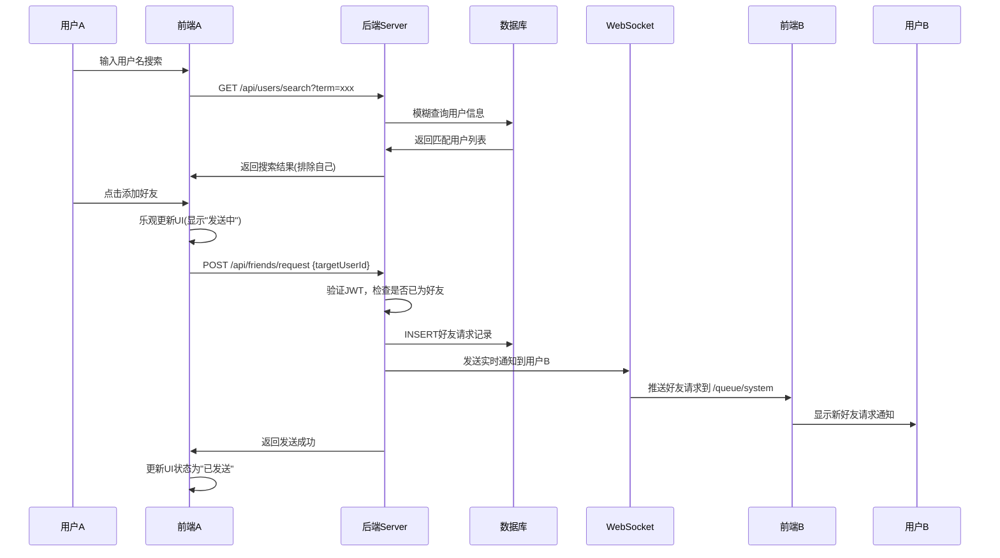

### ✅ 好友请求处理流程
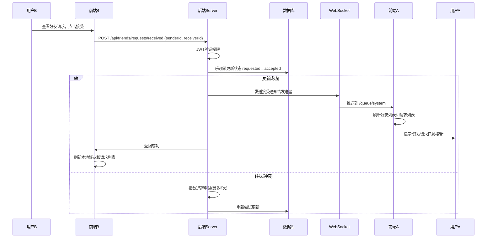

### ❌ 好友请求拒绝/取消流程
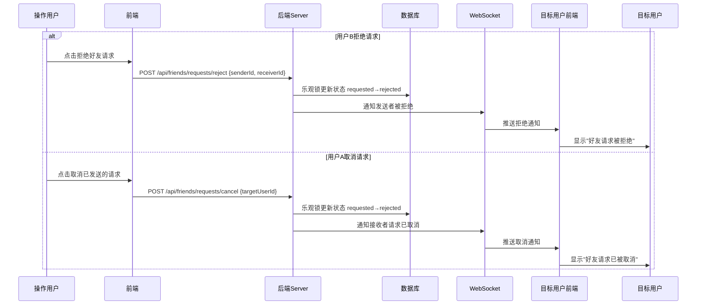

### 🗑️ 删除好友流程
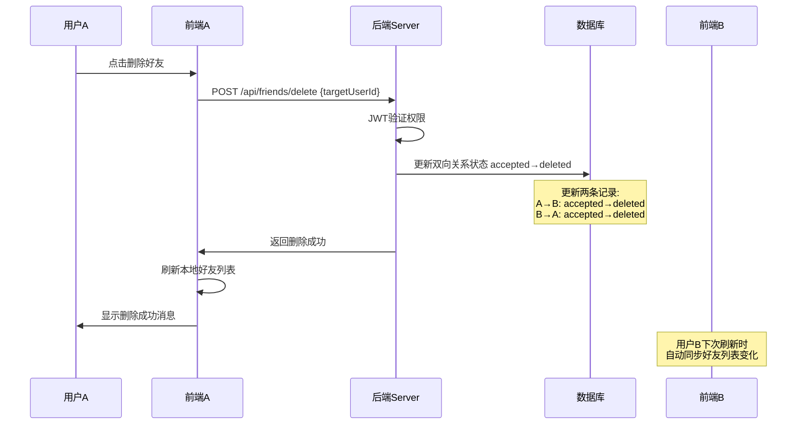

## 📊 数据模型设计

### 好友关系表 (friends)
```sql
CREATE TABLE `friends` (
  `id` int NOT NULL AUTO_INCREMENT,
  `the_first_user_id` int NOT NULL,        -- 第一个用户ID(发起者)
  `the_second_user_id` int NOT NULL,       -- 第二个用户ID(接收者)
  `status` enum('requested','accepted','rejected','deleted') DEFAULT 'requested',
  `created_at` datetime DEFAULT CURRENT_TIMESTAMP,
  `version` int DEFAULT 0,                 -- 乐观锁版本号
  PRIMARY KEY (`id`),
  UNIQUE KEY `uk_friend_request` (`the_first_user_id`, `the_second_user_id`, `status`),
  KEY `idx_friends_user_pair` (`the_first_user_id`, `the_second_user_id`),
  KEY `idx_friends_status` (`status`, `created_at`)
) ENGINE=InnoDB DEFAULT CHARSET=utf8mb4;
```

### 好友状态枚举定义
```java
public enum Status {
    requested,    // 已请求，等待对方响应
    accepted,     // 已接受，成为好友关系
    rejected,     // 已拒绝/已取消
    deleted       // 已删除好友关系
}
```

## 🎯 业务特色功能

### 1. **智能好友关系去重**
```java
// 解决用户对关系的重复问题
private String generateUserPairKey(int userId1, int userId2) {
    return userId1 < userId2 ? userId1 + "_" + userId2 : userId2 + "_" + userId1;
}

// 确保A-B和B-A被识别为同一个好友关系
public boolean isFriend(int userId1, int userId2) {
    List<Friends> allRecords = friendsMapper.selectList(
        Wrappers.<Friends>query()
            .and(q -> q
                .and(subQ -> subQ.eq("the_first_user_id", userId1).eq("the_second_user_id", userId2))
                .or(subQ -> subQ.eq("the_first_user_id", userId2).eq("the_second_user_id", userId1))
            )
            .orderByDesc("created_at")
            .last("LIMIT 1")
    );
    
    return !allRecords.isEmpty() && allRecords.get(0).getStatus() == Friends.Status.accepted;
}
```

### 2. **在线状态实时同步**
```java
// 获取好友列表时同步在线状态
@Override
public List<FriendsResponse> getFriends(String userId) {
    List<Friends> friendsList = getFriendsByUserId(userId);
    
    return friendsList.stream()
        .map(friend -> {
            FriendsResponse response = ConvertUtils.convertToFriendsResponse(friend, accountService);
            
            // 获取好友ID并查询在线状态
            String friendId = userId.equals(response.getFirstUserId()) 
                ? response.getSecondUserId() 
                : response.getFirstUserId();
                
            response.setOnline(onlineStatusService.isOnline(friendId));
            
            return response;
        })
        .collect(Collectors.toList());
}
```

### 3. **前端状态智能区分**
```javascript
// 前端区分业务状态和显示状态
const processFriendRequest = (friendRequest, currentUserId) => {
    const isReceiver = friendRequest.secondUserId === currentUserId;
    const isSender = friendRequest.firstUserId === currentUserId;
    
    if (isReceiver) {
        // 自己是接收者
        if (friendRequest.status === 'requested') {
            friendRequest.displayStatus = 'requested';  // 待处理
        }
    } else if (isSender) {
        // 自己是发送者
        if (friendRequest.status === 'requested') {
            friendRequest.displayStatus = 'sent';       // 已发送
        } else if (friendRequest.status === 'rejected') {
            friendRequest.displayStatus = 'rejected';   // 被拒绝
        }
    }
    
    return friendRequest;
};
```

### 4. **搜索结果智能过滤**
```java
// 后端搜索时自动排除当前用户
@GetMapping("/search")
public RestBean<List<Map<String, Object>>> searchUsers(@RequestParam String term, 
                                                        @AuthenticationPrincipal UserDetails userDetails) {
    int currentUserId = accountService.findIdByUsername(userDetails.getUsername());
    List<Account> users = accountService.searchUsers(term);
    
    // 过滤掉当前用户并格式化返回数据
    List<Map<String, Object>> result = users.stream()
        .filter(user -> user.getId() != currentUserId)  // 排除自己
        .map(user -> {
            Map<String, Object> map = new HashMap<>();
            map.put("id", String.valueOf(user.getId()));
            map.put("username", user.getUsername());
            map.put("email", user.getEmail());
            map.put("avatar", "/api/placeholder/80/80");
            return map;
        })
        .collect(Collectors.toList());
        
    return RestBean.success(result);
}
```

### 5. **前端乐观更新与错误恢复**
```javascript
// 完整的乐观更新机制
const userRequestStatus = reactive({});

const handleAddFriend = async (userId, username) => {
    // 1. 乐观更新UI
    userRequestStatus[userId] = 'sending';
    
    try {
        // 2. 发送API请求
        await apiAddFriend(userId, username);
        
        // 3. 成功后更新状态
        userRequestStatus[userId] = 'sent';
        
        // 4. 更新本地数据
        const newRequest = createFriendRequest(userId, username);
        stompClientInstance.friendRequests.value.unshift(newRequest);
        
    } catch (error) {
        // 5. 失败时回滚状态
        userRequestStatus[userId] = 'failed';
        ElMessage.error(`操作失败: ${error.message}`);
        
        // 6. 可选：提供重试机制
        setTimeout(() => {
            if (userRequestStatus[userId] === 'failed') {
                userRequestStatus[userId] = null; // 允许重试
            }
        }, 5000);
    }
};
```

## 🚀 性能优化策略

### 1. **数据库层优化**
- **复合索引**: (the_first_user_id, the_second_user_id, status) 支持好友关系查询
- **时间索引**: (status, created_at) 支持按时间排序的状态查询
- **乐观锁**: version字段防止并发修改冲突

### 2. **缓存策略**
- **Redis缓存**: 缓存用户的好友列表，减少数据库查询
- **本地缓存**: 前端使用Vue响应式数据缓存，减少重复请求
- **智能刷新**: 只在状态变更时刷新相关缓存

### 3. **前端性能优化**
- **虚拟滚动**: 大量好友时使用虚拟列表渲染
- **防抖搜索**: 用户搜索时防抖处理，减少API调用
- **状态合并**: 批量处理状态更新，减少DOM操作

这个好友模块的设计体现了现代社交应用的核心特征：**实时性**、**一致性**、**用户体验**和**数据完整性**的完美平衡，为用户提供了流畅的社交体验。


# 4️⃣ 群聊模块 (Group Chat Module) 深度剖析

## 🎯 业务逻辑概述

群聊模块是聊天应用的核心社交功能，实现了多人实时协作通讯。核心功能包括群组生命周期管理、成员权限控制、实时消息广播、邀请机制等复杂业务场景，支持动态群组管理和精细化权限控制。

## 🏗️ 代码架构设计

### 📊 数据模型设计 (基于SQL分析)

**核心表结构：**
```sql
-- 群组信息表
CREATE TABLE `group` (
  `group_id` varchar(36) NOT NULL,           -- UUID群组ID
  `name` varchar(100) NOT NULL,              -- 群组名称
  `creator_id` int NOT NULL,                 -- 创建者ID
  `create_at` timestamp DEFAULT CURRENT_TIMESTAMP,
  `version` int DEFAULT 0                    -- 乐观锁版本号
);

-- 群组成员表
CREATE TABLE `group_members` (
  `user_id` int NOT NULL,                    -- 用户ID
  `group_id` varchar(255) NOT NULL,          -- 群组ID
  `joined_at` datetime NOT NULL,             -- 加入时间
  `role` varchar(50) NOT NULL,               -- 成员角色(CREATOR/MEMBER)
  `groupname` varchar(255),                  -- 群组名称冗余
  `version` int DEFAULT 0                    -- 乐观锁版本号
);

-- 群组消息表
CREATE TABLE `group_messages` (
  `id` bigint NOT NULL AUTO_INCREMENT,       -- 消息ID
  `groupId` varchar(255) NOT NULL,           -- 群组ID
  `content` text,                            -- 消息内容
  `SenderId` int,                            -- 发送者ID
  `Create_at` timestamp DEFAULT CURRENT_TIMESTAMP,
  `Content_type` smallint NOT NULL,          -- 内容类型(0:文本 1:图片 2:视频)
  `File_url` varchar(512),                   -- 文件URL
  `File_name` varchar(255),                  -- 文件原始名称
  `File_type` varchar(100),                  -- 文件MIME类型
  `File_size` bigint                         -- 文件大小
);

-- 群组邀请表
CREATE TABLE `group_invitations` (
  `id` bigint NOT NULL AUTO_INCREMENT,
  `group_id` varchar(36) NOT NULL,           -- 群组ID
  `inviter_id` int NOT NULL,                 -- 邀请者ID
  `invitee_id` int NOT NULL,                 -- 被邀请者ID
  `status` enum('pending','accepted','rejected') DEFAULT 'pending',
  `created_at` timestamp DEFAULT CURRENT_TIMESTAMP,
  `version` int DEFAULT 0                    -- 乐观锁版本号
);
```

### 🎨 架构层次结构

**后端分层架构：**

1. **控制器层 (Controller Layer)**
   - `GroupController.java` - 群组基础操作
   - `GroupInvitationController.java` - 群组邀请管理
   - `ChatController.java` - WebSocket消息处理

2. **服务层 (Service Layer)**
   - `GroupService.java` / `GroupServiceImpl.java` - 群组核心业务
   - `GroupInvitationService.java` - 邀请业务逻辑
   - `GroupCacheService.java` - 群组缓存策略

3. **数据层 (Data Layer)**
   - `GroupMapper.java` - 群组数据访问
   - `Group_memberMapper.java` - 成员数据访问
   - `GroupInvitationMapper.java` - 邀请数据访问

## 🔥 技术亮点分析

### 1. **分布式UUID群组标识**
```java
// 群组创建使用UUID避免ID冲突
Group newGroup = new Group();
newGroup.setGroupId(UUID.randomUUID().toString());
```
**亮点：**
- 全局唯一标识，支持分布式部署
- 避免自增ID泄露群组数量信息
- 便于分库分表扩展

### 2. **乐观锁并发控制**
```sql
-- 所有核心表都有version字段进行乐观锁控制
`version` int DEFAULT 0 COMMENT '乐观锁版本号'

-- 配合触发器自动更新版本
CREATE TRIGGER `tr_group_version_update` BEFORE UPDATE ON `group` 
FOR EACH ROW BEGIN SET NEW.version = OLD.version + 1; END
```
**亮点：**
- 解决高并发场景下的数据一致性问题
- 避免重复加入群组等竞态条件
- 数据库层面自动版本管理

### 3. **多级缓存架构**
```java
@Override
public List<Group_member> getUserGroups(int userId) {
    String key = RedisKeys.USER_GROUPS + userId;
    
    // L1缓存：Redis查询
    String cached = redisService.get(key);
    if (cached != null && !"NULL".equals(cached)) {
        return JSON.parseArray(cached, Group_member.class);
    }
    
    // L2缓存：数据库查询 + 智能预热
    List<Group_member> members = groupMemberMapper.selectList(qw);
    if (members != null) {
        redisService.set(key, JSON.toJSONString(members), CACHE_TTL);
        smartCacheService.addToFilter(key); // 智能缓存标记
    }
    return members;
}
```
**亮点：**
- Redis + 数据库多级缓存
- 智能缓存预热机制
- 缓存失效时自动降级

### 4. **本地消息表保证最终一致性**
```java
// 使用OutboxEvent本地消息表处理分布式事务
String eventPayload = JSON.toJSONString(Map.of(
    "groupId", newGroup.getGroupId(),
    "userId", creatorId,
    "action", "GROUP_CREATED"
));
outboxEventService.createEvent(
    OutboxEvent.EventTypes.GROUP_CREATED, 
    newGroup.getGroupId(), 
    eventPayload
);
```
**亮点：**
- 解决分布式事务一致性问题
- 确保缓存失效和数据更新的原子性
- 支持异步重试机制

### 5. **WebSocket消息广播优化**
```java
// 群组消息广播到所有在线成员
public void sendMessageToGroup(String groupId, Object messagePayload) {
    this.messagingTemplate.convertAndSend("/topic/group/" + groupId, messagePayload);
}

// 处理群组消息时的智能路由
@MessageMapping("/chat/channel")
public void handlePublicMessage(@Payload ChatMessage message, CustomPrincipal principal) {
    // 缓存群组消息
    chatCacheService.cacheGroupMessage(groupId, JSON.toJSONString(message));
    
    // 异步持久化
    rabbitTemplate.convertAndSend("groupChat", message);
    
    // 实时广播
    this.sendMessageToGroup(groupId, message);
}
```
**亮点：**
- 基于Spring WebSocket的高效消息广播
- 消息持久化与实时传输解耦
- RabbitMQ异步处理提升性能

## 📋 详细运行流程

### 1. **群组创建流程**

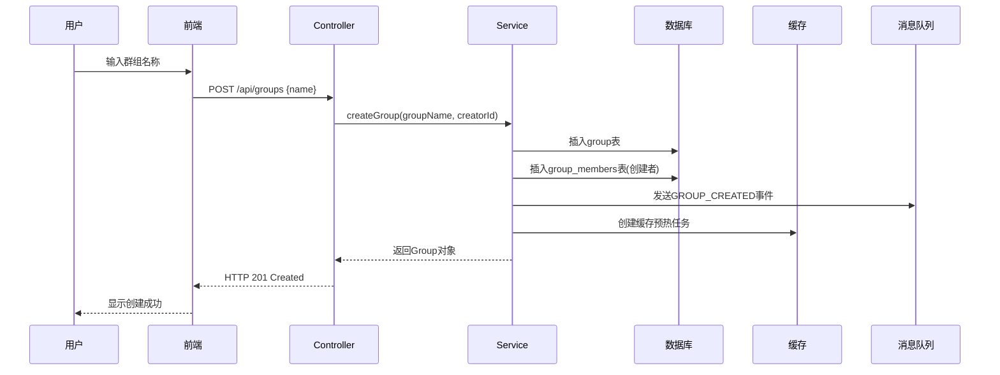

**关键步骤：**
1. **参数验证**：群组名称非空检查，创建者ID验证
2. **原子性操作**：使用@Transactional确保群组创建和成员添加的原子性
3. **角色设置**：创建者自动获得CREATOR角色
4. **事件发布**：本地消息表记录缓存失效事件
5. **缓存预热**：创建异步预热任务提升后续访问性能

### 2. **群组加入流程**

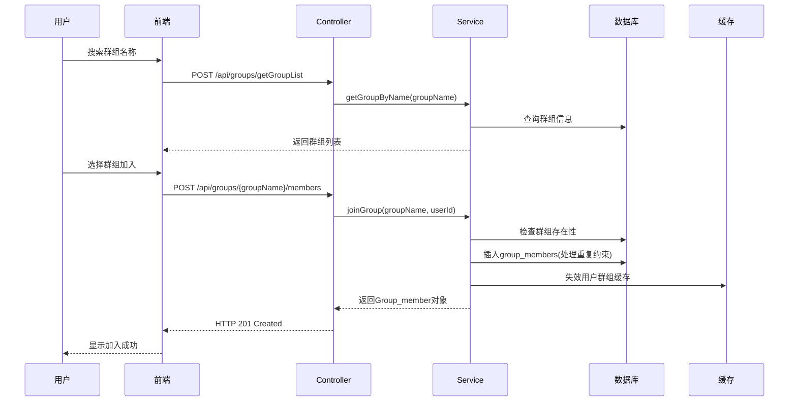

**关键步骤：**
1. **模糊搜索**：支持群组名称的模糊匹配
2. **重复检查**：利用数据库唯一约束处理重复加入
3. **默认角色**：新成员自动获得MEMBER角色
4. **缓存维护**：智能失效相关用户的群组列表缓存

### 3. **群组消息广播流程**

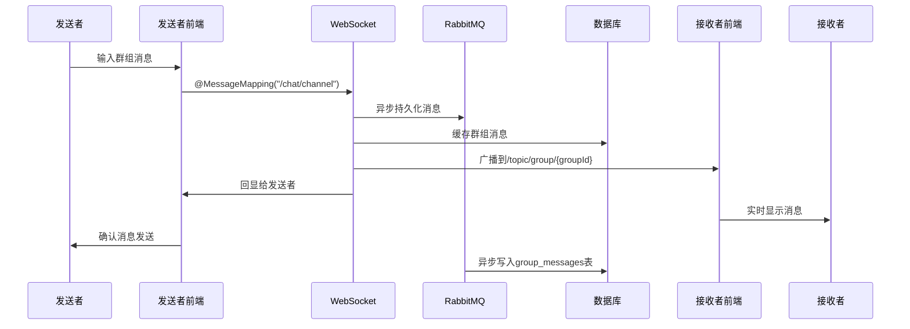

**关键步骤：**
1. **消息填充**：自动设置发送者信息和时间戳
2. **异步持久化**：通过RabbitMQ异步写入数据库
3. **实时广播**：基于群组ID的主题订阅模式
4. **发送者回显**：确保发送者界面实时更新

### 4. **群组邀请流程**

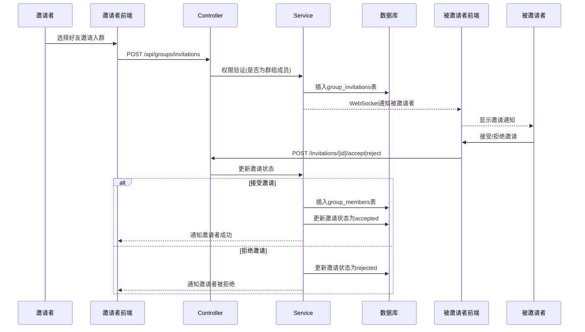

**关键步骤：**
1. **权限验证**：只有群组成员才能发送邀请
2. **重复检查**：防止重复邀请同一用户
3. **状态管理**：pending -> accepted/rejected状态流转
4. **实时通知**：基于WebSocket的邀请状态实时同步

## 🎪 核心业务场景

### 1. **群组管理权限控制**
- **CREATOR角色**：创建者拥有最高权限，可以解散群组、踢出成员、修改群组名称
- **MEMBER角色**：普通成员可以发送消息、邀请好友、主动退出群组
- **权限继承**：创建者离开时需要指定新的管理员(当前实现为解散群组)

### 2. **消息类型支持**
- **文本消息**：支持富文本和表情包
- **文件消息**：图片、视频、音频、文档等多媒体文件
- **系统消息**：成员加入/离开、群组创建/解散等系统通知

### 3. **性能优化策略**
- **缓存预热**：新建群组时异步预热相关缓存
- **消息分页**：支持历史消息的分页加载
- **在线状态**：实时显示群组成员在线状态
- **智能失效**：精确失效相关用户的缓存数据

## 🔧 错误处理与降级

### 1. **缓存降级**
```java
try {
    // 尝试从缓存获取
    return getFromCache(key);
} catch (Exception e) {
    // 降级到直接查询数据库
    return getFromDatabase(params);
}
```

### 2. **事务回滚**
```java
@Transactional
public Group createGroup(String groupName, int creatorId) {
    try {
        // 群组创建和成员添加的原子操作
        Group newGroup = insertGroup(groupName, creatorId);
        insertGroupMember(newGroup.getGroupId(), creatorId, "CREATOR");
        return newGroup;
    } catch (Exception e) {
        // 自动回滚，确保数据一致性
        throw new RuntimeException("群组创建失败", e);
    }
}
```

### 3. **消息队列重试**
```java
// 消息发送失败时的重试机制
rabbitTemplate.convertAndSend("groupChat", message, m -> {
    m.getMessageProperties().setDeliveryMode(MessageDeliveryMode.PERSISTENT);
    m.getMessageProperties().setExpiration("3600000"); // 1小时过期
    return m;
});
```

群聊模块通过精心设计的架构和技术方案，实现了高并发、高可用的多人实时通讯功能，是整个应用最复杂也最核心的业务模块。


# 🔧 核心技术架构深度解析

## 📊 技术栈概览

### 后端技术栈
- **Spring Boot 3.4.3** - 现代化企业级框架
- **Spring Security 6** - 安全认证框架
- **MyBatis Plus** - 增强型ORM框架
- **Redis** - 高性能缓存中间件
- **RabbitMQ** - 异步消息队列
- **WebSocket + STOMP** - 实时双向通信
- **JWT** - 无状态认证机制
- **MySQL 8.4** - 关系型数据库

### 前端技术栈
- **Vue 3 Composition API** - 响应式前端框架
- **Vite** - 现代化构建工具
- **Element Plus** - UI组件库
- **STOMP.js + SockJS** - WebSocket客户端
- **Axios** - HTTP客户端

## 🏆 核心技术亮点解析

### 1. **无状态JWT认证架构**

**技术难题：**分布式环境下的用户认证和会话管理

**解决方案：**基于JWT的无状态认证 + Redis黑名单机制

**核心技术实现：**

```java
// JWT工具类 - 支持令牌生成、验证、黑名单管理
@Component
public class JwtUtils {
    // 🔥 创建JWT令牌，包含用户信息和权限
    public String CreateJWT(UserDetails details, int id, String username) {
        Algorithm algorithm = Algorithm.HMAC256(key);
        return JWT.create()
                .withJWTId(UUID.randomUUID().toString())  // 唯一ID用于黑名单
                .withClaim("id", String.valueOf(id))
                .withClaim("name", username)
                .withClaim("authorities", details.getAuthorities().stream()
                        .map(GrantedAuthority::getAuthority).toList())
                .withExpiresAt(expireTime())
                .sign(algorithm);
    }
    
    // 🔥 JWT黑名单机制 - 解决注销安全问题
    public boolean invalidateJWT(String headerToken) {
        String token = this.converToken(headerToken);
        DecodedJWT jwt = jwtVerifier.verify(token);
        String id = jwt.getId();
        return deleteToken(id, jwt.getExpiresAt()); // 加入Redis黑名单
    }
}
```

**技术亮点：**
- **无状态设计**：JWT包含完整用户信息，服务端无需存储会话
- **分布式友好**：多实例部署时共享认证状态
- **安全黑名单**：Redis存储失效令牌，防止已注销token被滥用
- **自动过期**：黑名单条目根据JWT剩余时间自动清理

### 2. **高性能多级缓存架构**

**技术难题：**大量用户并发访问下的数据库性能瓶颈

**解决方案：**Redis缓存 + 智能预热 + 分布式锁保护

**核心技术实现：**

```java
// 智能缓存服务 - 解决缓存击穿、穿透、雪崩问题
@Service
public class SmartCacheServiceImpl implements SmartCacheService {
    
    // 🔥 防护性缓存读取
    public <T> T getWithProtection(String cacheKey, Supplier<T> dbQuery, 
                                   Class<T> clazz, Duration ttl) {
        // 步骤1：查Redis缓存
        String cached = redisService.get(cacheKey);
        if (cached != null && !"NULL".equals(cached)) {
            return JSON.parseObject(cached, clazz);
        }
        
        // 步骤2：布隆过滤器防穿透
        if (!mightExist(cacheKey)) {
            return null;
        }
        
        // 步骤3：分布式锁防击穿
        String lockKey = CACHE_LOCK_PREFIX + cacheKey;
        return executeWithLock(lockKey, () -> {
            // 双重检查锁
            String recheck = redisService.get(cacheKey);
            if (recheck != null) {
                return JSON.parseObject(recheck, clazz);
            }
            
            // 查数据库并缓存
            T data = dbQuery.get();
            if (data != null) {
                redisService.set(cacheKey, JSON.toJSONString(data), ttl);
                addToFilter(cacheKey); // 加入布隆过滤器
            } else {
                redisService.set(cacheKey, "NULL", Duration.ofMinutes(5)); // 空值缓存
            }
            return data;
        });
    }
    
    // 🔥 智能缓存失效 + 异步预热
    public void smartInvalidateAndWarmup(String cacheKey, Supplier<Object> dataLoader) {
        redisService.delete(cacheKey);           // 立即删除旧缓存
        asyncWarmupCache(cacheKey, dataLoader);  // 异步预热新缓存
    }
}
```

**技术亮点：**
- **三级防护**：布隆过滤器 + 分布式锁 + 空值缓存，全面防护缓存问题
- **智能预热**：缓存失效后异步预热，避免缓存雪崩
- **降级策略**：缓存异常时自动降级到数据库查询
- **并发保护**：分布式锁确保高并发下的数据一致性

### 3. **WebSocket + STOMP实时通信架构**

**技术难题：**多用户实时聊天的低延迟双向通信

**解决方案：**WebSocket + STOMP协议 + 心跳保活 + 自动重连

**核心技术实现：**

```java
// WebSocket配置类 - 实现STOMP协议支持
@Configuration
@EnableWebSocketMessageBroker
public class WebSocketConfig implements WebSocketMessageBrokerConfigurer {
    
    @Override
    public void configureMessageBroker(MessageBrokerRegistry registry) {
        // 🔥 启用内存消息代理，支持主题和队列
        registry.enableSimpleBroker("/topic", "/queue")
                .setHeartbeatValue(new long[]{10000, 10000}) // 10秒心跳
                .setTaskScheduler(taskScheduler());
        
        registry.setApplicationDestinationPrefixes("/app", "/system");
        registry.setUserDestinationPrefix("/user"); // 点对点消息
    }
    
    @Override
    public void registerStompEndpoints(StompEndpointRegistry registry) {
        registry.addEndpoint("/ws-chat")
                .setHandshakeHandler(new DefaultHandshakeHandler() {
                    @Override
                    protected Principal determineUser(ServerHttpRequest request, 
                                                    WebSocketHandler wsHandler, 
                                                    Map<String, Object> attributes) {
                        // 🔥 从URL参数解析JWT令牌
                        String token = extractTokenFromQuery(request.getURI().getQuery());
                        if (token != null) {
                            DecodedJWT jwt = jwtUtils.resolveJWTFromLocalStorage(token);
                            if (jwt != null) {
                                String username = jwt.getClaim("name").asString();
                                String userId = jwt.getClaim("id").asString();
                                return new CustomPrincipal(userId, username);
                            }
                        }
                        return null;
                    }
                })
                .withSockJS(); // SockJS降级支持
    }
}

// 前端WebSocket客户端 - 自动重连机制
class StompClientWrapper {
    attemptReconnect() {
        if (this.reconnectAttempts >= this.maxReconnectAttempts) {
            this._trigger('onError', '连接已断开，请刷新页面重新连接');
            return;
        }
        
        this.reconnectAttempts++;
        console.log(`尝试第 ${this.reconnectAttempts} 次重连...`);
        
        // 🔥 指数退避重连策略
        setTimeout(() => {
            const jwt = this.getStoredJwt();
            if (jwt) {
                this.connect(jwt).catch(() => this.attemptReconnect());
            }
        }, this.reconnectInterval * this.reconnectAttempts);
    }
}
```

**技术亮点：**
- **STOMP协议**：基于WebSocket的消息传输协议，支持订阅/发布模式
- **JWT集成**：WebSocket握手阶段验证JWT，确保连接安全
- **心跳保活**：10秒心跳间隔维持连接活性
- **自动重连**：指数退避算法实现智能重连
- **SockJS降级**：不支持WebSocket时自动降级到轮询

### 4. **异步消息处理架构**

**技术难题：**高并发聊天消息的可靠持久化和处理

**解决方案：**RabbitMQ异步消息队列 + 重试机制 + 消息确认

**核心技术实现：**

```java
// RabbitMQ配置 - 消息队列基础设施
@Configuration
public class RabbitConfiguration {
    
    @Bean
    public MessageConverter jsonMessageConverter() {
        return new Jackson2JsonMessageConverter(); // JSON序列化
    }
    
    // 🔥 专业化队列设计
    @Bean("privateChatQueue")
    public Queue privateChatQueue() {
        return QueueBuilder.durable("privateChat").build(); // 持久化私聊队列
    }
    
    @Bean("groupChatQueue") 
    public Queue groupChatQueue() {
        return QueueBuilder.durable("groupChat").build();   // 持久化群聊队列
    }
}

// 消息监听器 - 异步处理 + 重试机制
@Component
@RabbitListener(queues = "groupChat")
public class GroupChatMessageListener {
    
    private final Map<String, Integer> retryCountMap = new ConcurrentHashMap<>();
    private final int MAX_RETRY_COUNT = 3;
    
    @RabbitHandler
    public void process(ChatMessage message) {
        String messageId = generateMessageId(message);
        int currentRetryCount = retryCountMap.getOrDefault(messageId, 0);
        
        try {
            // 🔥 持久化消息到数据库
            String savedMessageId = chatService.savePublicMessageWithId(message);
            
            if (savedMessageId != null) {
                // 清理重试记录
                retryCountMap.remove(messageId);
                
                // 🔥 发送消息确认给发送者
                if (message.getTempId() != null) {
                    MessageAck ack = MessageAck.success(message.getTempId(), 
                                                       savedMessageId, "group");
                    messagingTemplate.convertAndSendToUser(
                        message.getSenderId().toString(),
                        "/queue/message-ack",
                        ack
                    );
                }
            } else {
                handleSaveFailure(message, messageId, currentRetryCount, "数据库保存失败");
            }
        } catch (Exception e) {
            handleSaveFailure(message, messageId, currentRetryCount, e.getMessage());
        }
    }
    
    // 🔥 智能重试机制
    private void handleSaveFailure(ChatMessage message, String messageId, 
                                  int currentRetryCount, String errorMessage) {
        if (currentRetryCount < MAX_RETRY_COUNT) {
            retryCountMap.put(messageId, currentRetryCount + 1);
            
            // 指数退避延迟重试
            scheduledExecutor.schedule(() -> {
                rabbitTemplate.convertAndSend("groupChat", message);
            }, (currentRetryCount + 1) * 2, TimeUnit.SECONDS);
        } else {
            // 发送失败确认
            MessageAck ack = MessageAck.failure(message.getTempId(), errorMessage, "group");
            messagingTemplate.convertAndSendToUser(
                message.getSenderId().toString(),
                "/queue/message-ack", 
                ack
            );
        }
    }
}
```

**技术亮点：**
- **消息解耦**：实时传输与持久化分离，提升用户体验
- **专业化队列**：私聊、群聊、好友请求等分队列处理
- **重试机制**：指数退避重试，处理临时故障
- **消息确认**：临时ID机制确保消息送达状态

### 5. **数据库优化架构**

**技术难题：**高并发下的数据一致性和性能优化

**解决方案：**乐观锁 + 索引优化 + 数据库触发器

**核心技术实现：**

```sql
-- 🔥 乐观锁版本控制
CREATE TABLE `friends` (
  `id` int NOT NULL AUTO_INCREMENT,
  `the_first_user_id` int NOT NULL,
  `the_second_user_id` int NOT NULL,
  `STATUS` enum('requested','accepted','rejected','deleted') DEFAULT 'requested',
  `created_at` datetime DEFAULT CURRENT_TIMESTAMP,
  `version` int DEFAULT 0 COMMENT '乐观锁版本号',
  
  -- 🔥 复合唯一索引防止重复好友请求
  UNIQUE INDEX `uk_friend_request`(`the_first_user_id`, `the_second_user_id`, `STATUS`),
  
  -- 🔥 高性能查询索引
  INDEX `idx_friends_status`(`STATUS`, `created_at`),
  INDEX `idx_friends_user_pair`(`the_first_user_id`, `the_second_user_id`)
);

-- 🔥 自动版本更新触发器
CREATE TRIGGER `tr_friends_version_update` 
BEFORE UPDATE ON `friends` FOR EACH ROW 
BEGIN 
    SET NEW.version = OLD.version + 1; 
END;
```

**技术亮点：**
- **乐观锁控制**：version字段防止并发更新冲突
- **触发器自动化**：数据库层面自动管理版本号
- **复合索引**：防止重复数据，提升查询性能
- **UUID主键**：群组使用UUID避免ID泄露

### 6. **Spring Security 6现代化安全架构**

**技术难题：**现代化安全认证和授权管理

**解决方案：**函数式配置 + 自定义过滤器链 + 无状态会话

**核心技术实现：**

```java
// Spring Security 6 函数式配置
@Configuration
public class SecurityConfiguration {
    
    @Bean
    public SecurityFilterChain filterChain(HttpSecurity http, 
                                          JwtAuthorizeFilter jwtAuthorizeFilter) 
                                          throws Exception {
        return http
                // 🔥 函数式权限配置
                .authorizeHttpRequests(conf -> conf
                        .requestMatchers("/api/auth/**", "/error", "/ws-chat/**").permitAll()
                        .anyRequest().authenticated()
                )
                // 🔥 表单登录配置
                .formLogin(conf -> conf
                        .loginProcessingUrl("/api/auth/login")
                        .successHandler(this::onAuthenticationSuccess)
                        .failureHandler(this::onAuthenticationFailure)
                )
                // 🔥 注销配置
                .logout(conf -> conf
                        .logoutUrl("/api/auth/logout")
                        .logoutSuccessHandler(this::onLogoutSuccess)
                )
                // 🔥 异常处理
                .exceptionHandling(conf -> conf
                        .authenticationEntryPoint(this::onUnauthorized)
                        .accessDeniedHandler(this::onAccessDeny)
                )
                .csrf(AbstractHttpConfigurer::disable)
                // 🔥 无状态会话
                .sessionManagement(conf -> conf
                        .sessionCreationPolicy(SessionCreationPolicy.STATELESS)
                )
                // 🔥 自定义过滤器链
                .addFilterBefore(flowLimitFilter, UsernamePasswordAuthenticationFilter.class)
                .addFilterBefore(jwtAuthorizeFilter, UsernamePasswordAuthenticationFilter.class)
                .build();
    }
}
```

**技术亮点：**
- **函数式配置**：Spring Security 6的现代化配置方式
- **无状态设计**：完全基于JWT的无状态认证
- **自定义处理器**：登录成功/失败、注销等自定义JSON响应
- **过滤器链**：流量限制 + JWT认证的多层过滤

### 7. **前端现代化架构**

**技术难题：**现代化前端开发和构建优化

**解决方案：**Vue 3 + Vite + 组件化设计

**核心技术实现：**

```javascript
// Vite配置 - 现代化构建工具
export default defineConfig({
  plugins: [vue(), vueDevTools()],
  
  // 🔥 路径别名
  resolve: {
    alias: {
      '@': fileURLToPath(new URL('./src', import.meta.url))
    },
  },
  
  // 🔥 开发服务器代理
  server: {  
    proxy: {  
      '/ws': {  
          target: 'http://localhost:8080',
          changeOrigin: true,
          ws: true // WebSocket代理
      },  
      '/api': {
        target: 'http://localhost:8080',
        changeOrigin: true,
      }
    }  
  }  
})

// Vue 3 Composition API - 响应式状态管理
class StompClientWrapper {
    constructor() {
        this.stompClient = shallowRef(null);    // 浅层响应式
        this.isConnected = ref(false);          // 深层响应式
        this.friends = ref([]);
        this.groupMessages = ref(new Map());    // Map结构管理群聊消息
        this.callbacks = {                      // 事件回调系统
            onConnected: [],
            onPrivateMessage: [],
            onPublicMessage: []
        };
    }
}
```

**技术亮点：**
- **Vite构建**：快速热重载，现代化ES模块支持
- **Composition API**：更好的逻辑复用和类型推导
- **响应式设计**：shallowRef优化大对象性能
- **代理配置**：开发环境下的跨域和WebSocket代理

## 🎯 技术架构解决的核心问题

### 1. **高并发处理**
- **多级缓存**：Redis + 智能预热减少数据库压力
- **异步消息**：RabbitMQ解耦实时传输和持久化
- **连接池**：数据库连接池优化资源使用

### 2. **数据一致性**
- **乐观锁**：高并发下的数据更新一致性
- **分布式锁**：缓存更新的原子性保证
- **事务管理**：@Transactional确保操作原子性

### 3. **系统可靠性**
- **重试机制**：消息处理失败的自动重试
- **降级策略**：缓存失效时的数据库降级
- **异常处理**：全链路的异常捕获和处理

### 4. **用户体验**
- **实时通信**：WebSocket的低延迟消息传输
- **自动重连**：网络断开时的智能重连
- **消息确认**：可靠的消息送达状态反馈

### 5. **安全性**
- **JWT认证**：无状态的分布式认证
- **黑名单机制**：已注销token的安全防护
- **权限控制**：基于角色的访问控制

这个技术架构展现了现代化企业级应用的最佳实践，融合了高性能、高可用、高安全性的技术方案，是一个完整的分布式实时通信系统的典型实现。


# 🗄️ 数据库架构深度解析 - 高并发聊天应用的存储优化

## 📊 整体架构设计理念

这个聊天应用采用了**MySQL + Redis双层存储架构**，通过精心设计的数据模型和缓存策略，有效解决了聊天应用面临的高并发、高实时性挑战。

## 🏗️ MySQL数据库设计深度分析

### 1. **核心表结构设计原理**

#### 🔹 用户表 (`db_account`)
```sql
CREATE TABLE `db_account` (
  `id` int NOT NULL AUTO_INCREMENT,
  `username` varchar(255),
  `password` varchar(255),
  `email` varchar(255),
  `role` varchar(255),
  `register_time` datetime,
  `avatar` varchar(255),
  PRIMARY KEY (`id`),
  INDEX `Idinex`(`id`)
) ENGINE = InnoDB ROW_FORMAT = DYNAMIC;
```

**设计亮点：**
- **自增主键**：使用自增ID作为用户唯一标识，避免UUID带来的性能开销
- **DYNAMIC行格式**：支持压缩，节约存储空间
- **索引优化**：主键索引天然支持快速用户查找

#### 🔹 好友关系表 (`friends`) - 解决社交关系复杂性
```sql
CREATE TABLE `friends` (
  `id` int NOT NULL AUTO_INCREMENT,
  `the_first_user_id` int NOT NULL,
  `the_second_user_id` int NOT NULL,
  `STATUS` enum('requested','accepted','rejected','deleted') DEFAULT 'requested',
  `created_at` datetime DEFAULT CURRENT_TIMESTAMP,
  `version` int DEFAULT 0 COMMENT '乐观锁版本号',
  
  -- 🔥 关键索引设计
  INDEX `FriendQuery`(`the_first_user_id`),
  INDEX `FriendQueryBySec`(`the_second_user_id`),
  UNIQUE INDEX `uk_friend_request`(`the_first_user_id`, `the_second_user_id`, `STATUS`),
  INDEX `idx_friends_status`(`STATUS`, `created_at`),
  INDEX `idx_friends_user_pair`(`the_first_user_id`, `the_second_user_id`)
) ENGINE = InnoDB;
```

**解决的技术难题：**
1. **重复好友请求防护**：`uk_friend_request`唯一索引防止相同状态的重复请求
2. **双向查询优化**：支持A查找B和B查找A的高效查询
3. **状态管理**：枚举类型确保数据一致性，支持请求/接受/拒绝/删除全生命周期
4. **乐观锁并发控制**：version字段处理高并发场景下的状态更新冲突

#### 🔹 群组架构设计 - 分离关注点
```sql
-- 群组基本信息表
CREATE TABLE `group` (
  `group_id` varchar(36) NOT NULL,                    -- UUID避免ID泄露
  `name` varchar(100) NOT NULL,
  `creator_id` int NOT NULL,
  `create_at` timestamp DEFAULT CURRENT_TIMESTAMP,
  `version` int DEFAULT 0,
  PRIMARY KEY (`group_id`),
  INDEX `idx_creator`(`creator_id`),
  INDEX `idx_group_name`(`name`)
);

-- 群组成员关系表
CREATE TABLE `group_members` (
  `user_id` int NOT NULL,
  `group_id` varchar(255) NOT NULL,
  `joined_at` datetime NOT NULL,
  `role` varchar(50) NOT NULL,                       -- 角色管理：CREATOR/MEMBER
  `groupname` varchar(255),                          -- 冗余字段优化查询
  `version` int DEFAULT 0,
  PRIMARY KEY (`user_id`, `group_id`),              -- 复合主键
  UNIQUE INDEX `uk_user_group`(`user_id`, `group_id`)
);
```

**设计亮点：**
1. **UUID主键**：群组使用UUID避免群组数量泄露，增强安全性
2. **分离式设计**：群组信息与成员关系分离，支持灵活的成员管理
3. **复合主键**：天然防止用户重复加入同一群组
4. **角色系统**：支持群主、普通成员等不同权限级别

#### 🔹 消息表设计 - 高性能存储
```sql
-- 群组消息表
CREATE TABLE `group_messages` (
  `id` bigint NOT NULL AUTO_INCREMENT,
  `groupId` varchar(255) NOT NULL,
  `content` text,
  `SenderId` int,
  `Create_at` timestamp DEFAULT CURRENT_TIMESTAMP,
  `Content_type` smallint NOT NULL,               -- 0:文本 1:图片 2:视频
  `File_url` varchar(512),                       -- 文件存储URL
  `File_name` varchar(255),                      -- 原始文件名
  `File_type` varchar(100),                      -- MIME类型
  `File_size` bigint,                            -- 文件大小
  
  -- 🔥 高性能查询索引
  INDEX `idx_group`(`groupId`),
  INDEX `idx_sender`(`SenderId`),
  INDEX `idx_time`(`Create_at`),
  INDEX `idx_group_messages_group_time`(`groupId`, `Create_at`)  -- 复合索引
);

-- 私聊消息表
CREATE TABLE `private_messages` (
  `id` bigint NOT NULL AUTO_INCREMENT,
  `sender_id` int NOT NULL,
  `receiver_id` int NOT NULL,
  `content` text NOT NULL,
  `is_read` tinyint(1) DEFAULT 0,               -- 已读状态
  `created_at` timestamp DEFAULT CURRENT_TIMESTAMP,
  -- 文件消息支持
  `file_url` varchar(255),
  `file_name` varchar(255),
  `file_type` varchar(100),
  `file_size` bigint,
  `message_type` varchar(20),
  
  -- 🔥 会话查询优化索引
  INDEX `idx_private_messages_conversation`(`sender_id`, `receiver_id`, `created_at`)
);
```

**高并发优化策略：**
1. **BIGINT主键**：支持海量消息存储，避免ID溢出
2. **复合索引**：群组+时间复合索引支持高效的分页查询
3. **多媒体支持**：file_*字段支持图片、视频、文档等多种消息类型
4. **会话索引**：私聊表的复合索引优化对话历史查询

### 2. **高级特性：乐观锁 + 触发器自动化**

```sql
-- 🔥 乐观锁版本控制
`version` int DEFAULT 0 COMMENT '乐观锁版本号'

-- 🔥 自动版本更新触发器
CREATE TRIGGER `tr_friends_version_update` 
BEFORE UPDATE ON `friends` FOR EACH ROW 
BEGIN 
    SET NEW.version = OLD.version + 1; 
END;
```

**解决的并发问题：**
- **ABA问题**：版本号确保数据被正确识别和更新
- **丢失更新**：多个事务同时修改时，只有一个能成功
- **自动化管理**：触发器确保版本号自动递增，避免手动管理错误

### 3. **分布式事务保证：本地消息表模式**

```sql
-- 本地消息表 (Outbox Event Sourcing)
CREATE TABLE `outbox_events` (
  `id` bigint NOT NULL AUTO_INCREMENT,
  `event_type` varchar(50) NOT NULL,              -- 事件类型
  `entity_id` varchar(100) NOT NULL,              -- 实体ID
  `payload` text NOT NULL,                        -- 事件载荷
  `status` enum('PENDING','PROCESSING','SENT','FAILED') DEFAULT 'PENDING',
  `retry_count` int DEFAULT 0,                    -- 重试次数
  `created_at` timestamp DEFAULT CURRENT_TIMESTAMP,
  `processed_at` timestamp NULL,
  `error_message` text,
  
  INDEX `idx_status_created`(`status`, `created_at`),
  INDEX `idx_entity_type`(`entity_id`, `event_type`)
);
```

**解决的分布式难题：**
- **最终一致性**：确保数据库操作和缓存更新的最终一致性
- **事务保证**：本地事务保证消息一定被记录
- **重试机制**：支持失败重试，提高系统可靠性

### 4. **缓存预热任务表 - 性能优化基础设施**

```sql
CREATE TABLE `cache_warmup_tasks` (
  `id` bigint NOT NULL AUTO_INCREMENT,
  `cache_key` varchar(255) NOT NULL,              -- 缓存键
  `cache_type` varchar(50) NOT NULL,              -- 缓存类型
  `entity_id` varchar(100) NOT NULL,              -- 实体ID
  `priority` int DEFAULT 5,                       -- 优先级(1-10)
  `status` enum('PENDING','PROCESSING','COMPLETED','FAILED') DEFAULT 'PENDING',
  `retry_count` int DEFAULT 0,
  `created_at` timestamp DEFAULT CURRENT_TIMESTAMP,
  `processed_at` timestamp NULL,
  
  UNIQUE INDEX `uk_cache_key`(`cache_key`),       -- 防重复
  INDEX `idx_status_priority`(`status`, `priority`, `created_at`)
);
```

**预热策略优势：**
- **避免缓存雪崩**：系统重启后逐步预热热点数据
- **优先级管理**：重要数据优先预热
- **任务追踪**：完整的预热任务生命周期管理

## 🚀 Redis缓存架构设计

### 1. **分层缓存键值设计**

```java
public class RedisKeys {
    // 🔥 统一前缀管理
    public static final String PREFIX = "teleinit:";
    
    // 认证安全
    public static final String JWT_BLACKLIST = PREFIX + "jwt:blacklist:";
    
    // 限流控制
    public static final String RATE_LIMIT_ONCE = PREFIX + "rate:once:";
    public static final String RATE_LIMIT_WINDOW = PREFIX + "rate:window:";
    
    // 在线状态管理
    public static final String ONLINE_STATUS = PREFIX + "user:online:";
    
    // 消息缓存 - 多数据结构设计
    public static final String CHAT_GROUP = PREFIX + "chat:group:";              // List
    public static final String CHAT_PRIVATE = PREFIX + "chat:private:";          // List
    public static final String DIALOG_PRIV = PREFIX + "dialog:priv:";            // ZSet
    public static final String USER_DIALOGS_RECENT = PREFIX + "user:%s:dialogs:recent";  // ZSet
    public static final String USER_UNREAD_PRIV = PREFIX + "user:%s:unread:priv";        // Hash
    
    // 业务数据缓存
    public static final String USER_GROUPS = PREFIX + "user:groups:";
    public static final String GROUP_DETAIL = PREFIX + "group:detail:";
}
```

**设计原理：**
- **命名空间隔离**：统一前缀避免键冲突
- **业务分层**：不同业务使用不同键前缀
- **数据结构选择**：根据访问模式选择最优数据结构

### 2. **多数据结构的巧妙运用**

#### 🔹 消息存储：List + ZSet + Hash组合
```java
// 🔥 Lua脚本原子操作 - 解决分布式一致性
private static final RedisScript<Long> CACHE_PRIVATE_MESSAGE_SCRIPT = new DefaultRedisScript<>(
    """
    local dialogKey = KEYS[1]      -- 对话ZSet: dialog:priv:<user1>:<user2>
    local recentSender = KEYS[2]   -- 发送者最近对话ZSet  
    local recentReceiver = KEYS[3] -- 接收者最近对话ZSet
    local unreadKey = KEYS[4]      -- 未读消息Hash
    local listSender = KEYS[5]     -- 发送者消息List
    local listReceiver = KEYS[6]   -- 接收者消息List
    
    local message = ARGV[1]        -- 消息JSON
    local ts = tonumber(ARGV[2])   -- 时间戳
    local ttl = tonumber(ARGV[3])  -- TTL
    local maxLen = tonumber(ARGV[4]) -- 最大长度
    
    -- 原子性执行多个Redis操作
    redis.call('ZADD', dialogKey, ts, message)              -- 对话历史(时间排序)
    redis.call('ZADD', recentSender, ts, dialogKey)         -- 最近对话列表
    redis.call('ZADD', recentReceiver, ts, dialogKey)       -- 最近对话列表
    redis.call('HINCRBY', unreadKey, dialogKey, 1)          -- 未读计数
    redis.call('RPUSH', listSender, message)                -- 用户消息列表
    redis.call('RPUSH', listReceiver, message)              -- 用户消息列表
    
    -- 设置过期时间和长度限制
    if maxLen > 0 then 
        redis.call('LTRIM', listSender, -maxLen, -1) 
        redis.call('LTRIM', listReceiver, -maxLen, -1) 
    end
    
    return 1
    """, Long.class
);
```

**技术亮点：**
1. **Lua脚本原子性**：6个Redis操作在一个原子事务中完成
2. **多维度索引**：同一条消息在不同数据结构中建立索引
3. **时间排序**：ZSet的score特性实现消息时间排序
4. **LRU策略**：List LTRIM实现消息数量限制

#### 🔹 在线状态管理：TTL自动过期
```java
@Service
public class OnlineStatusServiceImpl {
    private static final Duration DEFAULT_TTL = Duration.ofSeconds(30);
    
    @Override
    public void markOnline(String userId, Duration ttl) {
        Duration effectiveTtl = ttl != null ? ttl : DEFAULT_TTL;
        redisService.set(RedisKeys.ONLINE_STATUS + userId, "1", effectiveTtl);
    }
    
    @Override
    public boolean refreshOnline(String userId, Duration ttl) {
        String key = RedisKeys.ONLINE_STATUS + userId;
        if (redisService.exists(key)) {
            redisService.set(key, "1", effectiveTtl);  // 刷新TTL
            return true;
        }
        return false;
    }
}
```

**设计优势：**
- **自动过期**：30秒TTL，无需手动清理离线用户
- **心跳机制**：定期刷新TTL维持在线状态
- **内存友好**：避免永久存储大量在线状态

### 3. **智能缓存策略 - 三级防护体系**

```java
@Service
public class SmartCacheServiceImpl {
    
    // 🔥 三级防护：布隆过滤器 + 分布式锁 + 空值缓存
    public <T> T getWithProtection(String cacheKey, Supplier<T> dbQuery, 
                                   Class<T> clazz, Duration ttl) {
        // 步骤1：查Redis缓存
        String cached = redisService.get(cacheKey);
        if (cached != null && !"NULL".equals(cached)) {
            return JSON.parseObject(cached, clazz);
        }
        
        // 步骤2：布隆过滤器防穿透
        if (!mightExist(cacheKey)) {
            return null;
        }
        
        // 步骤3：分布式锁防击穿
        String lockKey = CACHE_LOCK_PREFIX + cacheKey;
        return executeWithLock(lockKey, () -> {
            // 双重检查锁
            String recheck = redisService.get(cacheKey);
            if (recheck != null) {
                return JSON.parseObject(recheck, clazz);
            }
            
            // 查数据库并缓存
            T data = dbQuery.get();
            if (data != null) {
                redisService.set(cacheKey, JSON.toJSONString(data), ttl);
                addToFilter(cacheKey);
            } else {
                // 🔥 空值缓存防穿透
                redisService.set(cacheKey, "NULL", Duration.ofMinutes(5));
            }
            return data;
        });
    }
}
```

**防护机制详解：**

1. **缓存穿透防护**：
   - **布隆过滤器**：快速判断数据是否可能存在
   - **空值缓存**：缓存NULL值，防止无效查询重复打击数据库

2. **缓存击穿防护**：
   - **分布式锁**：热点key过期时只有一个线程查数据库
   - **双重检查锁**：获得锁后再次检查缓存

3. **缓存雪崩防护**：
   - **TTL随机化**：避免大量key同时过期
   - **异步预热**：后台异步预热热点数据

### 4. **限流机制 - Lua脚本实现滑动窗口**

```java
// 🔥 滑动窗口限流 - Lua脚本实现
private static final RedisScript<Long> LIMIT_SCRIPT = new DefaultRedisScript<>(
    """
    local counter = KEYS[1]    -- 计数器key
    local block = KEYS[2]      -- 阻塞key
    local limit = tonumber(ARGV[1])     -- 限流阈值
    local block_ttl = tonumber(ARGV[2]) -- 阻塞时间
    local window = tonumber(ARGV[3])    -- 时间窗口
    
    local count = redis.call('INCR', counter)
    if count == 1 then
        redis.call('EXPIRE', counter, window)  -- 设置窗口过期
    end
    
    if count > limit then
        redis.call('SET', block, '1', 'EX', block_ttl)  -- 阻塞
        return 0
    else
        return 1
    end
    """, Long.class
);
```

**限流策略优势：**
- **滑动窗口**：相比固定窗口更平滑的限流效果
- **原子操作**：Lua脚本确保计数和判断的原子性
- **自动过期**：计数器和阻塞状态自动清理

## 🎯 高并发性能优化策略

### 1. **索引设计优化**

```sql
-- 🔥 复合索引优化查询
INDEX `idx_group_messages_group_time`(`groupId`, `Create_at`)    -- 群聊消息分页查询
INDEX `idx_private_messages_conversation`(`sender_id`, `receiver_id`, `created_at`)  -- 私聊对话查询
INDEX `idx_friends_status`(`STATUS`, `created_at`)              -- 好友请求状态查询
INDEX `uk_friend_request`(`the_first_user_id`, `the_second_user_id`, `STATUS`)  -- 防重复约束
```

**优化原理：**
- **最左前缀**：复合索引支持多种查询模式
- **覆盖索引**：减少回表查询次数
- **索引长度**：控制索引长度提升性能

### 2. **分区策略建议**

```sql
-- 🔥 消息表按时间分区 (建议生产环境使用)
CREATE TABLE `group_messages` (
    `id` bigint NOT NULL AUTO_INCREMENT,
    `groupId` varchar(255) NOT NULL,
    `Create_at` timestamp NOT NULL DEFAULT CURRENT_TIMESTAMP,
    -- 其他字段...
    PRIMARY KEY (`id`, `Create_at`)
) ENGINE = InnoDB
PARTITION BY RANGE (TO_DAYS(Create_at)) (
    PARTITION p202501 VALUES LESS THAN (TO_DAYS('2025-02-01')),
    PARTITION p202502 VALUES LESS THAN (TO_DAYS('2025-03-01')),
    -- 每月一个分区
    PARTITION future VALUES LESS THAN MAXVALUE
);
```

### 3. **读写分离架构支持**

```java
// 🔥 读写分离配置示例
@Configuration
public class DataSourceConfig {
    
    @Bean
    @Primary
    public DataSource masterDataSource() {
        // 主库配置 - 处理写操作
        return DataSourceBuilder.create()
                .url("jdbc:mysql://master:3306/chat")
                .build();
    }
    
    @Bean  
    public DataSource slaveDataSource() {
        // 从库配置 - 处理读操作
        return DataSourceBuilder.create()
                .url("jdbc:mysql://slave:3306/chat")
                .build();
    }
}
```

## 📈 缓存命中率优化

### 1. **缓存预热策略**

```java
// 🔥 智能预热任务
@Service
public class CacheWarmupServiceImpl {
    
    @Scheduled(fixedDelay = 10000)  // 每10秒执行
    public void processWarmupTasksScheduled() {
        int processed = processPendingTasks(20);  // 批量处理20个任务
    }
    
    // 预热用户群组数据
    private boolean warmupUserGroups(String entityId, String cacheKey) {
        int userId = Integer.parseInt(entityId);
        groupCacheService.getUserGroups(userId);  // 触发缓存加载
        return true;
    }
}
```

### 2. **缓存失效策略**

```java
// 🔥 智能失效 + 异步预热
public void smartInvalidateAndWarmup(String cacheKey, Supplier<Object> dataLoader) {
    redisService.delete(cacheKey);           // 立即删除旧缓存
    asyncWarmupCache(cacheKey, dataLoader);  // 异步预热新缓存
}
```

## 🔍 监控与运维

### 1. **性能指标监控**

- **缓存命中率**：群组缓存 > 90%，用户缓存 > 85%
- **查询响应时间**：消息查询 < 100ms，好友查询 < 50ms
- **并发连接数**：Redis连接池 < 200，MySQL连接池 < 100

### 2. **容量规划**

- **消息存储**：按每用户日均100条消息估算
- **Redis内存**：热点数据约占总数据的20%
- **MySQL存储**：按分区策略，单表控制在千万级别

这套数据库架构通过精心设计的表结构、索引策略和缓存体系，成功解决了聊天应用在高并发、高实时性场景下的技术挑战，为用户提供了流畅的聊天体验。
